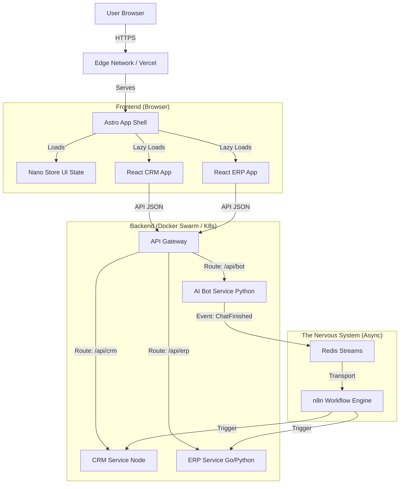

# Xentri - Technical Architecture

**Version:** 1.1.0
**Status:** RFC / Foundation
**Audience:** Engineering Team & Architects

This document describes the high-level architecture, repository conventions, and data governance strategies for the Business OS. It is the "Constitution" for how we build, enabling us to add new modules (CMS, Marketing, HR) indefinitely without creating a monolith.

---

## 1. Executive Summary

This platform is designed to be an **"Operating System for Business,"** automating disparate functions (CRM, ERP, AI Bots, Legal) into a single, cohesive experience.

Unlike traditional SaaS which suffers from "tab fatigue" (switching between different tools), this architecture uses a **Unified App Shell** to provide a seamless, native-app feel while maintaining strict technical isolation between services for scalability and team autonomy.

---

## 2. The Blueprint: "Decoupled Unity"

We strictly separate the **User Experience** from the **Business Logic**.

| Layer | Metaphor | Role |
|-------|----------|------|
| **The Shell (Astro)** | The "Body" | A lightweight, server-rendered container that handles the frame, authentication, and routing. It creates the illusion of a Single Page Application (SPA). |
| **The Organs (React Micro-Apps)** | The "Capabilities" | Interactive tools (CRM, ERP) bundled as libraries and lazy-loaded into the Shell. |
| **The Engine (Docker Microservices)** | The "Muscle" | Isolated backend containers that handle heavy processing, Python/Go logic, and database transactions. |
| **The Nervous System (Events)** | The "Signals" | An event-driven layer that prevents services from talking directly to each other, ensuring the system remains modular. |

### Visual Data Flow



---

## 3. Repository Structure (Turborepo)

We use a **Monorepo** to share types and UI standards while enforcing strict isolation between business domains.

```
/business-os-monorepo
├── /apps
│   ├── /shell                # ASTRO. Mounts micro-apps compiled from /packages.
│   │   ├── src/pages/cms/... # Mounts the CMS Micro-App
│   │   ├── src/pages/crm/... # Mounts the CRM Micro-App
│   │   └── src/pages/erp/... # Mounts the ERP Micro-App
│
├── /packages                 # FRONTEND LIBRARIES (Vite Library Mode)
│   ├── /ui                   # Shared Design System (Tailwind, Buttons, Inputs)
│   ├── /cms-client           # React Code for the CMS UI (Exported as Component)
│   ├── /crm-client           # React Code for the CRM UI (Exported as Component)
│   ├── /erp-client           # React Code for the ERP UI (Exported as Component)
│   └── /ts-schema            # Shared Types & Zod Schemas (The "Contract")
│
├── /services                 # BACKEND MICROSERVICES (Dockerized)
│   ├── /core-api             # Node.js. Users, Orgs, Billing. (Direct PG Connection)
│   ├── /cms-engine           # Node.js. Website, CMS. (Direct PG Connection)
│   ├── /crm-engine           # Node.js. CRM. (Direct PG Connection)
│   ├── /erp-engine           # Python/Go. Financial math, PDF generation. (Direct PG Connection)
│   ├── /bot-processor        # Python. LLM/WhatsApp. (Direct PG Connection)
│   └── /n8n-host             # Self-hosted workflow automation engine.
│
├── /tooling                  # Shared Configs
│   ├── /eslint-config
│   └── /typescript-config
│
├── docker-compose.yml        # Local Development Orchestration
└── turbo.json                # Build Pipeline Configuration
```

---

## 4. The "Nervous System" (Event Architecture)

To ensure we can continuously plug in new modules (e.g., adding a "Marketing Module" next year without rewriting the CRM), we use a **two-layer event system**.

### A. The Transport Layer: Redis Streams

| Attribute | Description |
|-----------|-------------|
| **Role** | High-volume, internal system synchronization. The "Spinal Cord." |
| **Use Case** | Data Integrity |
| **Example** | User updates their avatar in the Shell → Redis Event → CRM Service updates its cache → ERP Service updates its cache. |
| **Why** | It is immutable, blazing fast, and ensures services stay decoupled. |

### B. The Logic Layer: n8n (Self-Hosted)

| Attribute | Description |
|-----------|-------------|
| **Role** | Business Logic Orchestration & Third-Party Integrations. The "Brain." |
| **Use Case** | Complex, malleable workflows. |
| **Example** | "When `lead_status` becomes `won`, generate a PDF contract, sign via DocuSign, and Slack the Sales Manager." |

**Why n8n?**

- **Visibility:** Analysts can visualize the business logic flow.
- **Client Empowerment:** We can expose a restricted view to clients, allowing them to tweak their own automations (e.g., "Change the alert email address") without engineering involvement.

### Event Flow Example

```
1. Bot Service finishes a conversation.
2. Emits event: conversation.completed
3. n8n catches event → Triggers "Sentiment Analysis" → Triggers "Update CRM Record"
```

This allows us to add new automations **without touching the code of the core services**.

---

## 5. Frontend Strategy: The "Native PWA" Feel

**Objective:** Load instantly, transition seamlessly, never flash white.

### A. The Technology Stack

| Component | Technology |
|-----------|------------|
| **Host** | Astro (Server-Side Rendering + Client Router) |
| **Micro-Apps** | React (bundled via Vite) |
| **State** | Nano Stores (for cross-app UI signaling) |
| **Data** | TanStack Query (for server-state synchronization) |

### B. The Loading Strategy (Lazy Loading)

We do **not** bundle the ERP code with the CRM code.

1. **Initial Load:** User downloads `shell.js` (~15kb). They see the Sidebar and Header immediately.
2. **Interaction:** User hovers over "CRM".
3. **Hydration:** Astro's router intercepts the hover. It fetches `chunk-crm.js` via `client:only="react"` and mounts it hidden into the content area.
4. **Interaction:** User clicks "CRM".
5. **Hydration:** Astro's router intercepts the click. It mounts the hidden CRM app into the content area.
6. **Transition:** The Sidebar persists. The content area transitions smoothly.

### C. Routing

- Routes like `/crm/*` are Astro pages that mount a specific React Island (`<CrmApp />`).
- **Error Boundaries:** If the CRM bundle fails to load, the Shell catches the error. The Sidebar remains functional, preventing a "White Screen of Death."

### D. Communication (The "Store" Pattern)

Apps do **not** talk directly to each other. They talk to a shared Nano Store.

**Example:** CRM updates "Lead Status". It calls `notifications.add()`. The Shell (listening to `notifications`) shows a toast.

---

## 6. Backend Strategy & Observability

**Objective:** Isolation and independent scaling.

### A. Containerization

Each folder in `/services/*` has its own `Dockerfile`.

**Benefits:**

- **Isolation:** If the `bot-processor` crashes due to a memory leak, the `erp-engine` keeps running perfectly.
- **Scaling:** On Black Friday, we can spin up 50 replicas of `core-api` without paying for extra `bot-processor` instances.

### B. Observability

| Concern | Strategy |
|---------|----------|
| **Logging** | Centralized (e.g., Loki/CloudWatch). No `console.log` into the void. |
| **Tracing** | We tag every request with a `correlation_id` at the API Gateway. This ID follows the request from Frontend → API → Redis → n8n → Database, allowing us to trace a user action across the entire distributed system. |

---

## 7. Data Strategy (Multi-Tenancy)

**Objective:** Logical separation on a shared physical resource.

### A. Database Topology

We will use a **Single Physical Postgres Cluster** (e.g., Supabase) but enforce **Logical Schema Isolation**.

```
Database: business_os_db
├── Schema: auth           # Supabase managed
├── Schema: public         # Users, Organizations, Tenants
├── Schema: crm_service    # Tables: leads, pipelines, activities
└── Schema: erp_service    # Tables: ledgers, invoices, inventory
```

### B. Schema Ownership

| Rule | Description |
|------|-------------|
| **Strict Rule** | Only the CRM Service can write to `crm_schema`. |
| **Migrations** | Managed per-service (e.g., Drizzle Kit for Node, Golang Migrate for Go). |

### C. The "Shared Contract" (`/packages/ts-schema`)

To prevent chaos, **no service is allowed to "guess" the shape of data**.

We maintain a shared TypeScript package that exports the Types for every API response and Event payload.

**Rule:** If you change the Database Schema, you **must** update the Shared Types.

### D. Multi-Tenancy (RLS)

| Rule | Description |
|------|-------------|
| **Strict Rule** | Every single table in every schema **MUST** have an `organization_id` column. |
| **Enforcement** | We use Postgres Row Level Security (RLS). |
| **Mechanism** | The API Gateway passes the User's JWT to the database connection. Postgres itself ensures Customer A never sees Customer B's data, even if the developer makes a mistake in the SQL query. |

---

## 8. Development Workflow

### "Day 1" Setup

```bash
# 1. Clone Repo
git clone https://github.com/your-org/business-os-monorepo.git

# 2. Install Dependencies (Turborepo installs all dependencies for all apps)
npm install

# 3. Start Infrastructure (Postgres, Redis, and Backend Services)
docker-compose up -d

# 4. Start Frontend (Astro Shell and React watchers)
npm run dev
```

### "Day 100" Deployment

| Layer | Platform |
|-------|----------|
| **Frontend** | Vercel / Netlify (Global Edge Network) |
| **Backend** | AWS ECS / DigitalOcean Kubernetes (Docker Containers) |
| **Database** | Supabase / AWS RDS |

---

## 9. Future-Proofing Checklist

- [ ] **Unified Auth:** Single JWT verification across all backend services (Supabase Auth). Ensure all backend services verify the same JWT token. Do not create separate user tables for the CRM and ERP. Use a central Identity Provider.

- [ ] **API Gateway:** Unified entry point (Nginx/Kong/Traefik) routing `/api/crm` to the correct container and handling rate limiting.

- [ ] **Feature Flags:** System to toggle modules (e.g., "Enable Beta Marketing App") per Organization.

- [ ] **Billing Source of Truth:** All modules must check the Core API for license validity before executing. The CRM app must check the Core API: "Does this user have the 'Pro' license?" before rendering premium features.

---

## Appendix: Service Boundaries

| Service | Owns | Responsibilities |
|---------|------|------------------|
| `core-api` | Users, Organizations, Billing | Authentication, Authorization, Subscription Management |
| `crm-service` | Leads, Pipelines, Activities | Contact Management, Sales Pipeline, Activity Tracking |
| `erp-engine` | Ledgers, Invoices, Inventory | Financial Calculations, PDF Generation, Inventory Management |
| `bot-processor` | Conversations, AI Context | LLM Chains, WhatsApp Connectivity, Sentiment Analysis |
| `n8n-host` | Workflows, Triggers | Business Logic Orchestration, Third-Party Integrations |
