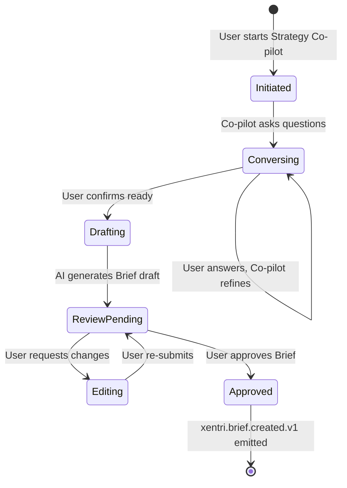
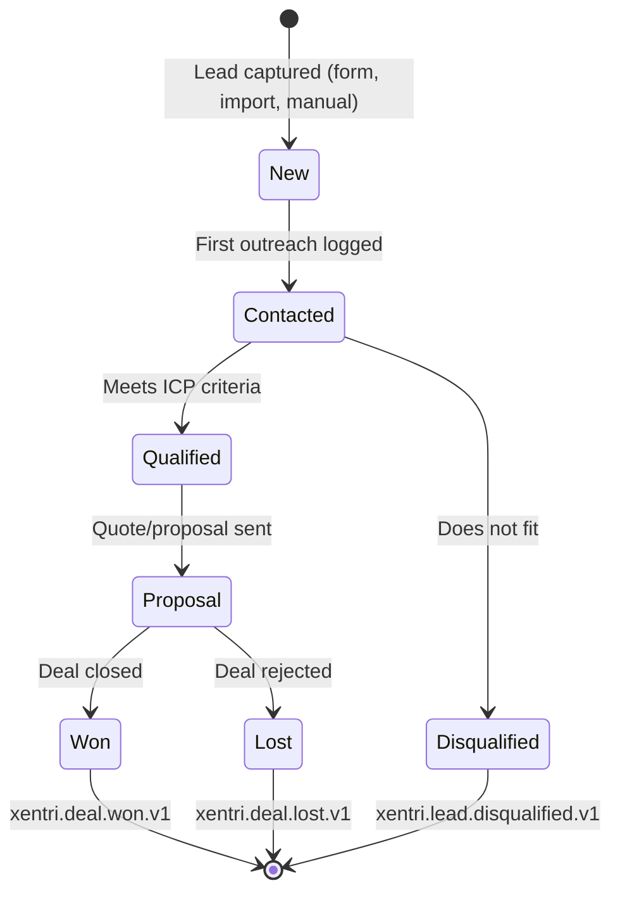
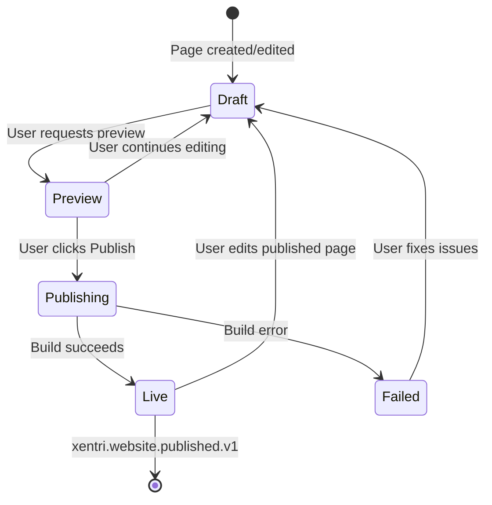

# Xentri Architecture

> **Status:** Draft
> **Version:** 1.1.0
> **Last Updated:** 2025-11-26

## 1. Executive Summary

Xentri is a Modular Business OS that starts with a Strategy Co-pilot conversation generating a Universal Brief—the DNA of the business—which then orchestrates downstream modules (Website, CRM, Invoicing). The architecture employs a Turborepo monorepo with an Astro Shell hosting React micro-apps, Node.js microservices communicating via an event-driven "Nervous System" (Redis/n8n), and a multi-tenant Postgres database with Row-Level Security.

### Core Architectural Principles

| Principle | Description |
|-----------|-------------|
| **Decoupled Unity** | Unified Shell (Astro) for seamless UX; isolated Micro-Apps (React) and Microservices (Node.js) for technical independence |
| **Event-Driven Backbone** | Services communicate via immutable events through Redis/n8n—no direct coupling; new modules integrate without rewrites |
| **Multi-Tenancy by Design** | Single Postgres cluster with RLS enforces "Client Zero" data isolation from day one |
| **Reality-In Data** | Ingest messy inputs (voice, text) and progressively structure them—no rigid forms upfront |

---

## 2. High-Level Architecture

We employ a **Monorepo** structure managed by **Turborepo**.

### The Stack

| Layer | Technology | Role |
| :--- | :--- | :--- |
| **Shell** | **Astro** | The container application. Handles routing, auth, layout, and "Islands" orchestration. |
| **Micro-Apps** | **React** | Interactive capabilities (CRM, CMS, etc.) loaded as "Islands" within the Shell. |
| **Backend** | **Node.js** | Dockerized microservices for business logic (Sales, Finance, etc.). |
| **AI Service** | **Python** | Hosts the Co-pilot Swarm (Strategy, Brand, Sales agents). |
| **Data** | **Postgres** | Single cluster with **RLS** for multi-tenancy. |
| **Events** | **Redis** | The "Nervous System" transport layer for high-volume synchronization. |
| **Orchestration** | **n8n** | Self-hosted workflow engine for complex business logic and integrations. |

### Decision Summary Table

| Category | Decision | Version | Rationale |
| :--- | :--- | :--- | :--- |
| Shell | Astro shell with React islands | Astro 5.16.0 / React 19.2.0 | Hybrid SSR/SSG with island hydration; stable React ecosystem for micro-apps. |
| Monorepo Tooling | Turborepo + pnpm workspaces | Turbo 2.6.1 / pnpm 10.23.0 | Fast incremental builds and deterministic installs across apps/services/packages. |
| Backend Runtime & API | Node.js + Fastify REST APIs | Node 24.11.1 LTS / Fastify 5.6.2 | Current LTS for runtime security; schema-first, high-performance JSON APIs. |
| Database & ORM | Postgres with Prisma | Postgres 16.11 / Prisma 7.0.1 | Typed queries with RLS support; aligns with event log and multi-tenant policies. |
| AuthN/AuthZ | Clerk + JWT cookies | @clerk/fastify 3.x / @clerk/astro 1.x | Delegates identity with native Organizations support; email/OAuth/SSO; multi-tenant JWT claims (org_id, role) out of the box. |
| Billing/Subscriptions | Clerk Billing (Stripe-backed) | Clerk Billing 1.x | Unified auth+billing; subscriptions tied to Clerk Organizations; supports module-based pricing model. (v0.4 scope) |
| Events & Transport | Postgres `system_events` log + Upstash Redis Streams | Upstash Redis (managed) | Durable source-of-truth log with pay-per-request streaming; scales from zero to millions. |
| Orchestration | n8n (self-hosted) | n8n 1.121.2 | Visual workflows and retries; separates business logic from app code. |
| File/Object Storage | S3-compatible blobs (prod: AWS S3, local: MinIO) | MinIO 8.0.6 client (server RELEASE.2024-09-30) | Presigned uploads for media/assets; CDN-friendly and infra-portable. |
| Deployment Target | Managed Kubernetes | k8s 1.31.0 | Standardized runtime for services, HPA-ready, secrets and ingress consistency. |
| Observability | OpenTelemetry traces + Pino JSON logs to Loki/Grafana | OTel SDK 1.9.0 / Pino 10.1.0 | Trace propagation across shell/services; structured logs for debugging. |

Version check date: 2025-11-26 (re-verify with WebSearch before releases).

### Version Compatibility Notes

| Technology | Compatibility Consideration |
|------------|----------------------------|
| **Node 24.x → 26.x** | Watch for ESM-only changes in core modules; test `--experimental-*` flags before upgrade |
| **Prisma 7.x** | Breaking: new migration format from v6; run `prisma migrate diff` before upgrading existing DBs |
| **Astro 5.x → 6.x** | Island hydration API may change; audit `client:*` directives |
| **React 19.x** | Concurrent features stable; Actions API replaces some form patterns—audit form handlers |
| **Fastify 5.x** | Plugin API stable; watch for hook signature changes in minors |
| **Redis 8.x** | Streams API stable; ACL syntax changed from v7—update connection configs if upgrading |

**Upgrade Protocol:** Before any major version bump: (1) check release notes for breaking changes, (2) run full test suite in staging, (3) update `ts-schema` contracts if API shapes change.

### System Diagram


---

## 3. Architecture Decision Records (ADRs)

### ADR-001: Universal Brief Orchestration (Knowledge Hierarchy)

**Context:** How do we ensure the "Universal Brief" effectively powers diverse downstream modules without creating a tight coupling or a "god object"?

**Decision:** We adopt a **Knowledge Hierarchy** pattern.
1.  **Universal Brief:** The shared source of truth (Identity, Offerings, Goals). Accessible by all Category Agents.
2.  **Category Context:** Domain-specific rules derived from the Brief (e.g., Brand Voice, Sales Pipeline). Managed by Category Agents.
3.  **Module Context:** Specific configurations (e.g., Website Pages, Quote Templates). Managed by Subagents.

**Implication:** Agents must first consult the Universal Brief, then their Category Context, before taking action.

### ADR-002: Event Envelope & Schema

**Context:** To prevent the "Nervous System" from becoming a swamp of untyped JSON, we need a strict event contract.

**Decision:** We enforce a strict `SystemEvent` envelope with namespaced types, versioning, and PII hygiene.

```typescript
type ISO8601 = string;

interface SystemEvent<TPayload = unknown> {
  id: string;                        // UUID (immutable)
  type: string;                      // e.g., "xentri.brief.updated"
  occurred_at: ISO8601;              // Business time
  
  org_id: string;                    // Tenant Context
  actor: { 
    type: "user" | "system" | "job"; 
    id: string 
  };

  envelope_version: "1.0";
  payload_schema: string;            // e.g., "brief.updated@2.1"
  payload: TPayload;                 // The facts, not the full DB dump

  // Reliability & Tracing
  dedupe_key?: string;               // Idempotency key
  correlation_id?: string;           // Workflow/Thread ID
  trace_id?: string;                 // Distributed Trace ID

  meta: {
    source: string;                  // e.g., "strategy-co-pilot"
    environment?: "local" | "staging" | "prod";
  };
}
```

**Implication:** All services must use the shared `packages/ts-schema` to validate events before emitting.

### ADR-003: Multi-Tenant Security (RLS & Context)

**Context:** We must ensure strict data isolation between organizations in a shared database.

**Decision:** We use **Postgres Row-Level Security (RLS)** with a **Fail-Closed** transaction pattern.

1.  **Transport:** Client sends `x-org-id` header.
2.  **Gate:** Middleware verifies `user_id` (from JWT) is a member of `x-org-id`. Rejects if false.
3.  **Transaction:** Service executes `SELECT set_config('app.current_org_id', $1, true)` at the start of the transaction. The `true` flag ensures the setting is **transaction-scoped** (equivalent to `SET LOCAL`), preventing connection pool leakage.
4.  **Enforcement:** RLS policies explicitly check for the presence of the variable and fail closed if missing.

```sql
-- Example Policy (Fail Closed)
CREATE POLICY tenant_isolation ON some_table
USING (
  current_setting('app.current_org_id', true) IS NOT NULL
  AND org_id = current_setting('app.current_org_id', true)::uuid
);
```

### ADR-004: Railway Bootstrap Deployment Strategy

**Context:** The architecture specifies Kubernetes as the deployment target, but K8s setup requires 40-80 hours of work before shipping any product value. We need a strategy that balances immediate velocity with long-term scalability.

**Decision:** We adopt a **Bridge Strategy**: deploy to Railway (PaaS) for bootstrapping, migrate to Kubernetes when triggered by spend ($500/mo) or compliance requirements.

**Key Constraints:**
1. **Docker-first:** All services deployed via standard `Dockerfile`, explicitly rejecting Nixpacks. Containers are cloud-portable from day one.
2. **Redis with Volume:** Railway Redis requires attached volume for Streams persistence. Pin version ≥5.0 for Streams invariants.
3. **n8n Queue Mode:** Deploy with separate main + worker services; `N8N_ENCRYPTION_KEY` is a "crown jewel" requiring secure backup.
4. **Config as Code:** All settings in `railway.toml` files—no clickops drift.

**Migration Triggers:**
- Monthly spend > $500
- Compliance requirement (SOC2, GDPR DPA)
- First paying customer (Redis HA becomes critical)
- Any written SLA commitment

**Artifacts:**
- Full decision record: `docs/architecture/adr-004-railway-bootstrap.md`
- Deployment guide: `docs/deployment-plan.md`
- K8s migration runbook: `docs/k8s-migration-runbook.md`

**Implication:** Story 1.7 (DevOps) references these artifacts. K8s migration is a bounded project with IaC (Terraform + Helm), not ongoing hero work.

---

## 4. Project Structure & FR/Epic Coverage

The repository follows a standard Turborepo monorepo structure:

```text
/xentri-monorepo
├── /apps
│   └── /shell                # Astro: The main container
├── /packages
│   ├── /ui                   # Shared Design System
│   ├── /ts-schema            # Shared Types, Zod Schemas, Event Definitions
│   ├── /cms-client           # React Micro-App: CMS
│   ├── /crm-client           # React Micro-App: CRM
│   └── /...                  # Other Micro-Apps
├── /services
│   ├── /core-api             # Node.js: Auth, Billing, Org Management
│   ├── /brand-engine         # Node.js: Website, CMS Backend
│   ├── /sales-engine         # Node.js: CRM, Quotes Backend
│   ├── /ai-service           # Python: Co-pilot Swarm
│   └── /n8n-host             # Workflow Engine
└── /tooling                  # Shared Configs (ESLint, TSConfig)
```

### Mapping to PRD Functional Requirements (FR) and Epics
- **apps/shell** → FR26-33 (shell UX, navigation, responsive), FR75-78 (notifications UI). Epic 1 (Foundation & Access).
- **packages/ts-schema** → FR33-36 (events), FR16 (Brief schemas), all cross-service contracts. Epic 1 and 2.
- **services/core-api** → FR1-6, FR37 (auth/signup/login events), FR82 (RLS enforcement), FR75-78 (notifications sending), FR5 (account deletion). Epic 1, 6.
- **services/brand-engine** → FR40-59 (website/CMS), FR58 (content_published event). Epic 3.
- **services/sales-engine** → FR60-67 (leads), FR63 (lead_created event). Epic 4.
- **services/ai-service** → FR10-25, FR69-74 (Strategy/Brand co-pilots). Epic 2 and 5.
- **services/n8n-host** → FR33-36 (event-driven flows), FR148 (orchestration readiness). Cross-epic automation.
- **packages/ui** → Shared components for shell/micro-apps (supports FR40-47 UX).
- **packages/cms-client, packages/crm-client** → Frontend micro-apps for brand/sales capabilities (FR40-67).

### Service Interface Summaries (MVP scope)
- **core-api**
  - Endpoints: `POST /api/v1/auth/signup`, `POST /api/v1/auth/login`, `POST /api/v1/orgs` (auto-create), `DELETE /api/v1/account` (FR5).
  - Emits: `xentri.user.signup.v1`, `xentri.user.login.v1`, `xentri.org.created.v1`.
  - Contracts: User, Org, Notification schemas in `packages/ts-schema`.
- **brand-engine**
  - Endpoints: `GET/PUT /api/v1/sites/:id`, `POST /api/v1/sites/:id/publish`, `GET/PUT /api/v1/pages/:id`, `POST /api/v1/media/presign`.
  - Emits: `xentri.website.published.v1`, `xentri.page.updated.v1`, `xentri.content.published.v1`.
  - Contracts: Site, Page, Content, MediaAsset schemas in `packages/ts-schema`.
- **sales-engine**
  - Endpoints: `GET/POST /api/v1/leads`, `GET/PUT /api/v1/leads/:id`, `POST /api/v1/leads/:id/status`.
  - Emits: `xentri.lead.created.v1`, `xentri.lead.updated.v1`, `xentri.followup.scheduled.v1`.
  - Contracts: Lead, FollowUp schemas in `packages/ts-schema`.
- **ai-service**
  - Endpoints: `POST /api/v1/brief/generate` (Strategy Co-pilot), `POST /api/v1/brief/sections/:sectionId/propose`, `POST /api/v1/brand/copy/suggest`.
  - Emits: `xentri.brief.created.v1`, `xentri.brief.updated.v1`, `xentri.ai.proposal.generated.v1`.
  - Contracts: Brief, BriefSectionProposal, BrandCopySuggestion schemas in `packages/ts-schema`.
- **n8n-host**
  - Subscribes: Redis Streams for all `xentri.*` events; runs idempotent flows with org context.
  - Responsibilities: Notifications fan-out, cache invalidation messages, cross-service orchestrations (e.g., `brief.updated` triggers website refresh prompt).

### Contract Source of Truth
- `packages/ts-schema/src/api.ts` — API envelope and Problem Details types.
- `packages/ts-schema/src/auth.ts` — User and service JWT claims.
- `packages/ts-schema/src/events.ts` — Event envelope and actor/meta.
- `packages/ts-schema/src/cache.ts` — Cache keys and invalidation events (brief, site, leads).
- CI: `.github/workflows/schema-check.yml` runs `tsc` against these definitions to prevent drift.

---

## 5. Deployment & Environments

### Deployment Target
- **Target:** Managed Kubernetes v1.31.0 (GKE/EKS/AKS) with NGINX Ingress, cert-manager (ACME), ExternalDNS, and ExternalSecrets for vault-backed creds.
- **Services:** Each service as a Deployment + HPA (min 2 replicas prod), ConfigMaps for non-secret config, Secrets for JWT keys/webhooks, and dedicated Postgres/Redis managed services.
- **Networking:** Ingress per app domain (`app.xentri.app`, `api.xentri.app`, `n8n.xentri.app`), TLS via cert-manager, service-to-service auth via signed JWT and network policies.

### Environment Plan
- **Local (docker compose):** Postgres 16.11, Redis 8.4.0, n8n 1.121.2, MinIO (S3-compatible). Clerk Auth via hosted project (no local container needed). Command: `docker compose up -d postgres redis n8n minio`.
- **Staging (k8s 1.31):** Managed Postgres (RDS/CloudSQL), managed Redis (ElastiCache/MemoryStore), n8n as k8s Deployment with PVC, MinIO optional (prefer cloud blob). 1-2 replicas per service with HPA, metrics/alerts wired.
- **Production (k8s 1.31):** Same as staging with multi-AZ Postgres/Redis, HPA min 2, PodDisruptionBudgets, and regional buckets/CDN for assets.

### Project Initialization (from scratch, no starter template)
- **Package manager:** pnpm 10.23.0 (via Corepack).
- **Starter:** From scratch (Turborepo + pnpm). Search term for verification: "create turbo pnpm monorepo".
- **Bootstrap commands:**

```bash
# Enable workspace tooling
corepack enable

# Install workspace deps
pnpm install

# Start data plane locally
docker compose up -d postgres redis n8n minio

# Dev servers (run in parallel shells)
pnpm run dev --filter apps/shell
pnpm run dev --filter services/core-api
pnpm run dev --filter packages/ui -- --watch
```

---

## 6. Implementation Patterns

### A. The "Shared Contract"
All data shapes (API responses, Event payloads, DB models) are defined in `/packages/ts-schema`.
*   **Rule:** No service "guesses" the shape of data.
*   **Workflow:** Change DB Schema -> Update `ts-schema` -> Update Service.

### B. Frontend "Islands"
We use Astro's Island Architecture to lazy-load React apps.
*   **Shell:** Handles the "Frame" (Sidebar, Header, Auth).
*   **Navigation:** Hovering a sidebar item pre-fetches the React bundle.
*   **Mounting:** Clicking mounts the React app into the content area.
*   **State:** `Nano Stores` are used for cross-island communication (e.g., a "New Lead" toast triggered by the CRM island).

### C. The "Nervous System" Flow
1.  **Emit:** Service A emits `xentri.lead.created` to Redis.
2.  **Process:** `n8n` subscribes to the event.
3.  **Orchestrate:** `n8n` executes logic (e.g., "If high value, Slack the CEO").
4.  **React:** `n8n` may call Service B (CRM) to update a record.

### D. API & Error Conventions
- **Protocol:** JSON REST over HTTPS; versioned prefix `/api/v1`.
- **Shape:** Envelope with `data`, `error`, `meta` (cursor/paging). Dates in ISO8601 UTC.
- **Errors:** HTTP Problem Details (`application/problem+json`) with `type`, `title`, `status`, `detail`, `trace_id`.
- **Auth:** JWT (Clerk) in HTTP-only cookie via `@clerk/fastify` middleware; services accept `Authorization: Bearer` for service-to-service calls. Org context from JWT `org_id` claim; `x-org-id` header optional for org-switching.
- **Idempotency:** For mutating endpoints that can retry, require `Idempotency-Key` header and persist to dedupe.

### E. Auth Patterns
- **User Auth:** Clerk for sign-in/up with native Organizations support. Access token includes `sub`, `org_id`, `org_role`, `org_permissions`. Session managed via Clerk SDK.
- **Social OAuth:** Multiple providers supported via Clerk (Google, Apple, Microsoft, etc.). Adding providers is a dashboard configuration, not code change. MVP: Google + Apple.
- **Service Auth:** Signed JWT with short TTL; verified per service; propagate `trace_id` and `org_id`.
- **Org Scoping:** Middleware extracts `org_id` from Clerk JWT claims (set when user selects active organization); RLS enforces at DB. Header `x-org-id` used only for org-switching validation.

### F. Naming & Location Patterns
- **API routes:** `/api/v1/{service}/{resource}` (plural nouns). Example: `/api/v1/brand/sites`.
- **Events:** `xentri.{boundedContext}.{action}.{version}` e.g., `xentri.brief.updated.v1`.
- **Database tables:** `snake_case`, always include `org_id`, `id` UUID primary key, `created_at`, `updated_at`.
- **Files:** 
  - Apps: `apps/shell/src/routes/...`, `apps/shell/src/components/...`
  - Services: `services/{svc}/src/routes`, `services/{svc}/src/domain`, `services/{svc}/src/infra`
  - Shared: `packages/ts-schema/src`, `packages/ui/src`, utilities in `packages/lib/src`
- **Tests:** Co-locate as `__tests__` or `*.test.ts` next to source.

### G. Lifecycle Patterns
- **Loading/Error UX:** Skeletons for primary content; inline errors with retry; toast only for non-blocking notices.
- **Retries:** Client retries idempotent GETs with backoff; mutations rely on server idempotency keys.
- **Background Jobs:** n8n flows must be idempotent; retries with exponential backoff; dead-letter to `redis:stream:dlq`.

---

## 7. Cross-Cutting Concerns

*   **Authentication:** Clerk with native Organizations. Unified user identity across all services; org membership and roles managed by Clerk.
*   **Logging:** Centralized structured logging (JSON) with `trace_id` propagation.
*   **Error Handling:** Standardized error responses (Problem Details for HTTP APIs).
*   **Testing:**
    *   Unit Tests: Jest/Vitest per package.
    *   E2E Tests: Playwright running against the full docker-compose stack.
*   **Caching:** 
    *   API: HTTP cache-control for GETs; CDN for public assets; service-layer Redis for hot data with TTL.
    *   Invalidation: Event-driven (Redis Stream) to bust projections; explicit cache tags per resource type.
*   **Object Storage:** S3/MinIO for assets; presigned PUT/GET; store only keys/metadata in DB.
*   **Performance Budgets:** p75 FMP < 2s on 3G for shell; API p95 < 300ms for reads, < 600ms for writes; background jobs complete < 30s or enqueue follow-up.
*   **Observability:** OpenTelemetry traces across shell/services; logs to Loki/Grafana; metrics via Prometheus; `trace_id` propagated through API and events.
*   **n8n Reliability:** Workers run with queue-backed execution; retry with backoff (3 attempts), DLQ to Redis stream `n8n:dlq`; flows must be idempotent and check org context.
*   **Cache/Invalidation Map:**
    *   Brief: key `brief:{org_id}` in Redis; invalidated on `xentri.brief.updated.v1`; projections downstream rehydrate.
    *   Site: key `site:{org_id}:{site_id}` and CDN path `/sites/{site_id}`; purge on `xentri.website.published.v1` or `xentri.page.updated.v1`.
    *   Leads: key `leads:list:{org_id}` with cursor; bust on `xentri.lead.created.v1` and `xentri.lead.updated.v1`; entity cache `lead:{org_id}:{lead_id}` updated in write path.

---

## 8. Operational Model: Solo Visionary + AI Agent Army

### Development Philosophy

This project is built using **AI-first development** via the BMAD Method. One human visionary (Carlo) directs an army of AI agents who handle implementation. No corners are cut—the architecture is production-grade.

### Why This Architecture Suits AI-First Development

| Architectural Choice | AI Agent Benefit |
|---------------------|------------------|
| **Service boundaries** | Agents work on isolated services without merge conflicts or cross-contamination |
| **`ts-schema` contracts** | Explicit types prevent agents from "guessing" data shapes—compile-time enforcement |
| **Event-driven communication** | Services don't call each other directly—agents can't introduce tight coupling |
| **ADRs with implications** | Agents have clear guidance on architectural intent, not just "what" but "why" |
| **Naming conventions** | Deterministic patterns mean agents produce consistent code across sessions |
| **Co-located tests** | Agents can write and run tests in the same context as the code they're modifying |

### Supervisor Responsibilities (Human)

| Area | Responsibility |
|------|----------------|
| **Vision & Strategy** | Define product direction, prioritize epics, approve PRD/architecture changes |
| **Quality Gates** | Review AI-generated code before merge; run validation workflows |
| **Architectural Decisions** | Make trade-off decisions when agents surface options; approve ADR changes |
| **Security Review** | Audit auth flows, RLS policies, and secrets handling before production |
| **External Integrations** | Configure third-party services (Clerk, cloud providers, payment processors) |
| **Production Operations** | Monitor alerts, handle incidents, approve deployments |

### AI Agent Boundaries

| Scope | Agents Can Independently | Requires Human Review |
|-------|-------------------------|----------------------|
| **Feature implementation** | Write code following established patterns | New patterns or architectural changes |
| **Tests** | Write unit/integration tests, fix failing tests | E2E test strategy changes |
| **Bug fixes** | Fix bugs within existing service boundaries | Fixes requiring cross-service changes |
| **Documentation** | Update inline docs, README sections | Architecture docs, ADRs |
| **Refactoring** | Refactor within a service following conventions | Refactors affecting `ts-schema` contracts |
| **Dependencies** | Update patch versions | Major version upgrades (see compatibility notes) |

### Human Escalation Triggers

Bring in a human specialist (contractor) when:

- **Security audit** — Before first production deployment and annually thereafter
- **Compliance requirements** — GDPR, SOC2, or region-specific regulations (CFDI for Mexico)
- **Performance crisis** — If p95 latencies exceed budgets and AI agents can't diagnose
- **Infrastructure migration** — Moving between cloud providers or major k8s upgrades
- **Legal/financial integrations** — Payment processors, tax APIs, legal document generation

### Scaling Triggers

| Trigger | Action |
|---------|--------|
| **> 100 concurrent users** | Increase HPA min replicas; review Redis connection pooling |
| **> 1,000 orgs** | Consider Postgres read replicas; review RLS policy performance |
| **> 10,000 events/hour** | Scale Redis cluster; add n8n worker pods |
| **Revenue > $10k MRR** | Security audit; consider managed k8s support contract |
| **Adding regulated features** | Engage compliance consultant before implementation |

---

## 9. State Machines for Complex Flows

### Brief Generation Flow



**States:**
- `Initiated` — Session started, no data yet
- `Conversing` — Multi-turn Q&A active
- `Drafting` — AI processing, generating sections
- `ReviewPending` — Draft complete, awaiting user review
- `Editing` — User making manual edits
- `Approved` — Final, triggers downstream modules

### Lead Lifecycle Flow



**States:**
- `New` — Just captured, no contact yet
- `Contacted` — At least one outreach attempt
- `Qualified` — Confirmed as viable opportunity
- `Disqualified` — Removed from pipeline
- `Proposal` — Active deal negotiation
- `Won/Lost` — Terminal states

### Website Publish Flow



**States:**
- `Draft` — Content being edited, not visible publicly
- `Preview` — Rendered for review, not live
- `Publishing` — Build/deploy in progress
- `Live` — Publicly accessible
- `Failed` — Build error, needs intervention

---

## 10. Validation Summary

| Dimension | Score |
|-----------|-------|
| **Architecture Completeness** | Complete |
| **Version Specificity** | All Verified |
| **Pattern Clarity** | Crystal Clear |
| **AI Agent Readiness** | Ready |

**Validation Date:** 2025-11-26

### Addressed in v1.1.0
- Executive summary condensed to 2 sentences; principles moved to table format
- Version compatibility notes added with upgrade protocol
- Operational model documented for Solo Visionary + AI Agent Army
- State machine diagrams added for Brief, Lead, and Website flows
- Scaling triggers documented with specific thresholds

### Remaining Actions (Implementation Phase)
1. ~~**`packages/ts-schema`** — Formalize Zod schemas from TypeScript examples during Epic 1 implementation~~ ✓ Done (Story 1.1)
2. **Cache invalidation** — Implement cache/invalidation config per bounded context when building services
3. ~~**CI enforcement** — Add schema-check workflow when setting up GitHub Actions~~ ✓ Done (Story 1.1)

**Epic 1 Story 1.1 Complete:** Foundation infrastructure established with 14 tests passing, RLS verified via smoke tests, GitHub branch protection configured.

---

## 11. Future Considerations

*   **Secondary Geo Expansion:** Architecture supports adding region-specific compliance modules (e.g., `finance-engine-mx` for CFDI) without altering the core `finance-engine`.
*   **Mobile App:** The API-first design allows a future React Native app to consume the same microservices.
