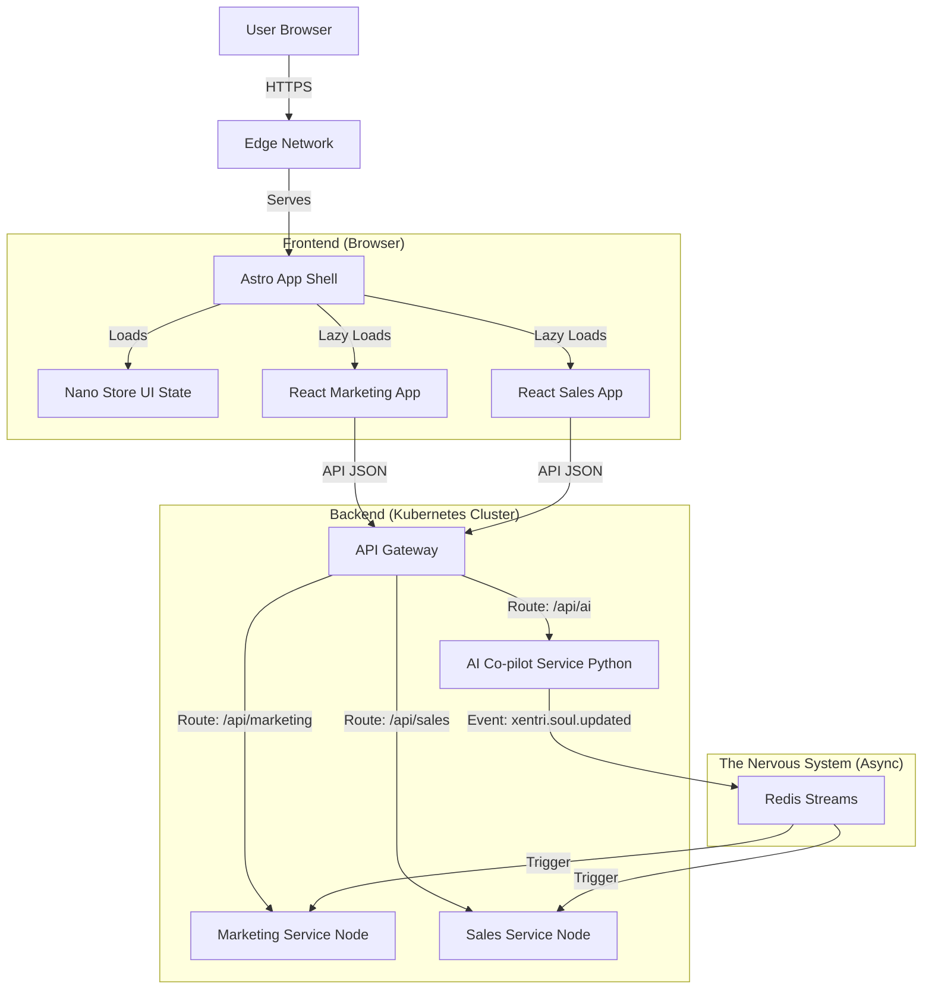

# Xentri Architecture (System Constitution)

> **Status:** Approved
> **Version:** 3.0
> **Last Updated:** 2025-12-03
> **Level:** System (applies to ALL entities)
>
> **Note:** This document contains DECISIONS only. Implementation details live in Infrastructure Module documents (shell, core-api, ts-schema, ui).

---

## 1. Executive Summary

Xentri is a **Fractal Business Operating System** orchestrated by a hierarchical network of autonomous AI agents. It starts with a Strategy Co-pilot conversation generating a Strategy Soul (the DNA of the business), which then guides downstream agents (Marketing, Sales, Finance) who manage their own specialized categories, sub-categories and individual modules/tools.

### Core Architectural Principles

| Principle | Description |
|-----------|-------------|
| **Decoupled Unity** | Unified Shell (Astro) for seamless UX; isolated Micro-Apps (React), Tool Services (Node.js), and Agent Services (Python) for technical independence |
| **Event-Driven Backbone** | Services communicate via immutable events through Redis—no direct coupling; new modules integrate without rewrites |
| **Multi-Tenancy by Design** | Single Postgres cluster with RLS enforces "Client Zero" data isolation from day one |
| **Reality-In Data** | Ingest messy inputs (voice, text) and progressively structure them—no rigid forms upfront |

---

## 2. High-Level Architecture

We employ a **Monorepo** structure managed by **Turborepo**.

### The Stack

| Layer | Technology | Role |
|:------|:-----------|:-----|
| **Shell** | **Astro** | The container application. Handles routing, auth, layout, and "Islands" orchestration. |
| **Micro-Apps** | **React** | Interactive capabilities (CRM, CMS, etc.) loaded as "Islands" within the Shell. |
| **Backend** | **Node.js** | Dockerized microservices for business logic (Sales, Finance, etc.). |
| **Agent Layer** | **Python** | Reasoning & Intelligence. Powers the ~42 complex Agents (7 Category Co-pilots + 35 Sub-Category Agents). |
| **Data** | **Postgres** | Single cluster with RLS for multi-tenancy. |
| **Events** | **Redis** | The "Nervous System" transport layer for high-volume synchronization. |

### Decision Summary Table

| Category | Decision | Version | Rationale |
|:---------|:---------|:--------|:----------|
| Shell | Astro shell with React islands | Astro 5.x / React 19.x | Hybrid SSR/SSG with island hydration; stable React ecosystem for micro-apps. |
| Monorepo Tooling | Turborepo + pnpm workspaces | Turbo 2.x / pnpm 10.x | Fast incremental builds and deterministic installs. |
| Backend Runtime & API | Node.js + Fastify REST APIs | Node 24.x LTS / Fastify 5.x | Current LTS for runtime security; schema-first, high-performance JSON APIs. |
| Database & ORM | Postgres with Prisma | Postgres 16.x / Prisma 7.x | Typed queries with RLS support. |
| AuthN/AuthZ | Clerk + JWT cookies | @clerk/* packages | Native Organizations support; multi-tenant JWT claims (org_id, role). |
| Events & Transport | Postgres `system_events` + Redis Streams | Upstash Redis (managed) | Durable source-of-truth log with pay-per-request streaming. |
| Deployment Target | Managed Kubernetes | k8s 1.31+ | Standardized runtime for services, HPA-ready. |
| Observability | OpenTelemetry + Pino JSON logs | OTel SDK 1.x / Pino 10.x | Trace propagation across shell/services. |

**Version Management:** Re-verify versions with WebSearch before releases. See module PRDs for specific version requirements.

### System Diagram



---

## 3. Architecture Decision Records (ADRs)

> **Format:** Each ADR contains Context, Decision, and Implication. Implementation details are delegated to Infrastructure Module documents.

### ADR-001: Universal Soul Orchestration (Knowledge Hierarchy)

**Status:** Accepted

**Context:** How do we ensure the "Universal Soul" effectively powers diverse downstream modules without creating a tight coupling or a "god object"?

**Decision:** We adopt a **Knowledge Hierarchy** pattern:

1. **Universal Soul:** The shared source of truth (Identity, Offerings, Goals). Accessible by all Category Agents.
2. **Category Context:** Domain-specific rules derived from the Soul (e.g., Brand Voice, Sales Pipeline). Managed by Category Agents.
3. **Module Context:** Specific configurations (e.g., Website Pages, Quote Templates). Managed by Subagents.

**Implication:** Agents must first consult the Universal Soul, then their Category Context, before taking action.

---

### ADR-002: Event Envelope & Schema

**Status:** Accepted

**Context:** To prevent the "Nervous System" from becoming a swamp of untyped JSON, we need a strict event contract.

**Decision:** We enforce a strict `SystemEvent` envelope with namespaced types, versioning, and PII hygiene. All events include:

- Immutable ID and timestamp
- Tenant context (org_id)
- Actor identification
- Envelope version and payload schema reference
- Tracing fields (correlation_id, trace_id, dedupe_key)

**Implication:** All services must use the shared `packages/ts-schema` to validate events before emitting.

**Implementation:** See `docs/platform/ts-schema/prd.md` for schema definition (IC-001).

---

### ADR-003: Multi-Tenant Security (RLS & Context)

**Status:** Accepted

**Context:** We must ensure strict data isolation between organizations in a shared database.

**Decision:** We use **Postgres Row-Level Security (RLS)** with a **Fail-Closed** transaction pattern:

1. **Transport:** Client sends `x-org-id` header.
2. **Gate:** Middleware verifies `user_id` (from JWT) is a member of `x-org-id`. Rejects if false.
3. **Transaction:** Service sets transaction-scoped org_id context before queries.
4. **Enforcement:** RLS policies fail closed if context is missing.

**Implication:** Every table must have `org_id` column. Every query runs within RLS context.

**Implementation:** See `docs/platform/core-api/prd.md` for middleware details (FR-API-001, FR-API-004).

---

### ADR-004: Kubernetes First (Category Cluster Strategy)

**Status:** Accepted

**Context:** We have ~42 Agents and ~130 Tools planned. Deploying as ~175 separate services on a PaaS is cost-prohibitive.

**Decision:** We deploy to **Managed Kubernetes** with a **Category Consolidation** pattern:

- **Agent Plane (Python):** 7 Deployments (1 per Category), each hosting Category Co-pilot + Sub-Category Agents.
- **Tool Plane (Node.js):** 7 Deployments (1 per Category), each hosting API endpoints for that Category.
- **Frontend Plane:** 1 Shell Deployment + static assets via CDN.

**Total Services:** ~15 (7 Agents + 7 Tools + 1 Shell).

**Implication:** We need Helm Chart templates that can be instantiated per category.

---

### ADR-006: Tri-State Memory Architecture

**Status:** Accepted

**Context:** Agents need long-term memory that mimics human recall (Facts, Experiences, Persona).

**Decision:** We implement a **Tri-State Memory System**:

1. **Semantic Memory (The Soul):** Structured facts about the business. Storage: Postgres (JSONB) + Redis Cache.
2. **Episodic Memory (The Journal):** Time-series log of what happened. Storage: pgvector.
3. **Synthetic Memory (The Persona):** Compressed wisdom derived from episodes. Storage: System Prompt.

**Implication:** A background "Dreaming" process runs nightly to compress Episodes into Synthetic Memory.

---

### ADR-007: Federated Soul Registry

**Status:** Accepted

**Context:** We have 42 Agents. Managing 42 separate system prompts is impossible.

**Decision:** We use a **Federated Prompt Composition** strategy:

- **Layer 1 (Global Soul):** Universal values shared by ALL agents.
- **Layer 2 (Category Context):** Domain expertise shared by Category Agents.
- **Layer 3 (Agent Role):** Specific job unique to each Agent.

**Composition:** `Final Prompt = Global Soul + Category Context + Agent Role + Universal Soul`.

---

### ADR-008: Python for Agent Layer

**Status:** Accepted

**Context:** ~130 modules are standard business tools (CRUD). ~42 are complex AI agents. Using Python for everything kills frontend velocity. Using Node for everything kills AI velocity.

**Decision:** We introduce a dedicated **Python Agent Layer** for all complex AI agents.

- **Scope:** Heavy Reasoning, LLM Chains, Data Science, Complex Agents.
- **Why:** Native home of AI (LangChain, PyTorch, Pandas).

**Implication:** Clear boundary between business logic (Node.js) and AI logic (Python). Communication via Redis Streams and API contracts.

---

### ADR-009: Cross-Runtime Contract Strategy

**Status:** Accepted

**Context:** `ts-schema` is our contract source of truth, but Python services can't consume TypeScript directly.

**Decision:** We use a **JSON Schema Bridge** for cross-runtime contract enforcement:

```
ts-schema (Zod) → zod-to-json-schema → schemas/*.json → datamodel-codegen → py-schema/*.py
```

**Schema Versioning Protocol:**
1. Bump version on breaking changes
2. N-1 support during migration window
3. 30 days deprecation notice

**Implication:** CI enforces schema generation on any ts-schema change.

**Implementation:** See `docs/platform/ts-schema/epics.md` (Story TSS-1.3).

---

### ADR-010: Resilience & Graceful Degradation

**Status:** Accepted

**Context:** The architecture assumes everything works. We need patterns for when things fail.

**Decision:** We implement a 3-tier resilience strategy:

1. **Rate Limiting:** API Gateway (per org), Service Layer (per endpoint), Copilot Layer (token budget).
2. **Graceful Degradation:** Tools must work without Agents. Events may delay but CRUD must work.
3. **Chaos Testing:** Weekly Redis/Agent tests; monthly Postgres/Network tests.

**Key Principle:** Tools must never depend on Agents to function.

---

### ADR-011: Hierarchical Pulse Architecture

**Status:** Accepted

**Context:** The UX requires that every hierarchy level exposes its own Pulse view.

**Decision:** We implement a **Fractal Pulse System** where each level produces and consumes Pulse data.

| Level | Pulse View | Audience |
|-------|------------|----------|
| **Strategy** | What survived all 4 layers of filtering | Owner/Founder |
| **Category** | What's happening in that category | Category managers |
| **Sub-category** | What's happening in that sub-category | Team leads |
| **Module** | What's happening in that module | Module users |

**Implication:** Each agent level must implement Pulse output generation.

**Implementation:** See `docs/platform/ts-schema/prd.md` for PulseItem schema (FR-TSS-005).

---

### ADR-012: Copilot Widget Architecture

**Status:** Accepted

**Context:** The UX specifies a draggable widget that summons the context-relevant copilot.

**Decision:** We implement a **Context-Aware Copilot Widget** as a Shell-level component.

| State | Appearance | Behavior |
|-------|------------|----------|
| **Collapsed** | Small icon + badge | User-positionable |
| **Panel** | Right or bottom panel | Shares screen with SPA |
| **Full** | Replaces main section | Full copilot focus |

**Implication:** Shell must track navigation context and pass it to the widget.

**Implementation:** See `docs/platform/shell/ux-design.md` and `docs/platform/ui/epics.md` (Story UI-2.2).

---

### ADR-013: Narrative Continuity & UX Philosophy

**Status:** Accepted

**Context:** Users shouldn't feel like they are "checking a dashboard" but rather "reading a story" of their business.

**Decision:** We adopt a **Narrative-First** UX philosophy:

1. **Chronicle View (Default):** Journal-like feed ("Since yesterday...", "Story Arcs").
2. **Efficiency/Power Toggle:** Dense, list-based view for power users.
3. **No-Scroll Constraint:** The entire app must fit in the viewport.
4. **Theme Architecture:** Multiple themes (Modern, Power, Traditional) via CSS variables.

**Implication:** Story Arcs as a new data entity; Session Bridging for absence detection.

**Implementation:** See `docs/platform/ts-schema/prd.md` for StoryArc schema (FR-TSS-006).

---

### ADR-014: Module Registration Architecture (IC-003)

**Status:** Accepted

**Context:** The Shell must dynamically discover and load modules without hard-coding references.

**Decision:** We implement a **Declarative Module Manifest** system where each module exposes a YAML manifest at build time.

**Manifest includes:**
- Module identity (id, name, category)
- Routes and navigation
- Permissions required
- Events emitted/consumed
- Soul fields read

**Implication:** Every module must include a valid `manifest.yaml`. Shell cannot load modules without manifests.

**Implementation:** See `docs/platform/ts-schema/epics.md` for ModuleManifest schema (Story TSS-3.1).

---

### ADR-015: Permission Enforcement Architecture (IC-007)

**Status:** Accepted

**Context:** PRD defines four permission primitives (`view`, `edit`, `approve`, `configure`). We need enforcement patterns.

**Decision:** We implement a **3-Layer Permission Enforcement** pattern:

| Layer | Responsibility | Enforcement Point |
|-------|----------------|-------------------|
| **Shell (UI)** | Hide/disable UI elements | Component render |
| **API Gateway** | Block unauthorized requests | Middleware |
| **Database (RLS)** | Prevent data access | Query execution |

**Fail-Closed Principle:** Missing permission context = deny.

**Implication:** All three layers must be implemented for any protected resource.

**Implementation:** See `docs/platform/core-api/prd.md` (FR-API-007) and `docs/platform/ui/prd.md` (PermissionGate component).

---

### ADR-016: Soul Access Architecture (IC-004, IC-005)

**Status:** Accepted

**Context:** Modules need to read Soul data and submit recommendations for updates.

**Decision:** We implement a **Soul Gateway Service** that mediates all Soul access.

- **IC-004:** Read-only access via `GET /api/v1/soul` endpoints with caching.
- **IC-005:** Recommendation submission via event protocol. High-confidence + low-impact = auto-approve.

**Implication:** Modules can influence Soul but never write directly.

**Implementation:** See `docs/platform/core-api/prd.md` (FR-API-005, FR-API-006).

---

### ADR-017: Notification Delivery Architecture (IC-006)

**Status:** Accepted

**Context:** The Operational Pulse requires a unified notification system that respects user attention.

**Decision:** We implement a **Priority-Based Notification Router**:

| Priority | Delivery | Channel |
|----------|----------|---------|
| **critical** | Immediate | Push + Email + In-app |
| **high** | Digest | Email digest + In-app |
| **medium** | Digest | Email digest + In-app |
| **low** | In-app only | Dashboard only |

**Implication:** Modules emit events with notification metadata. Infrastructure handles routing.

---

### ADR-018: Automated Action Explanation Pattern (PR-006)

**Status:** Accepted

**Context:** PR-006 mandates that all automated actions be logged with human-readable explanation.

**Decision:** We implement an **Explainable Action** system where every automated action includes:

- What action was taken
- Who/what took it
- Human-readable explanation (summary + reasoning)
- Reversibility information

**Implication:** Copilots and automations must generate explanations before acting.

---

### ADR-020: Sibling Dependency Law (Entity Document Structure)

**Status:** Accepted

**Context:** We need clear rules for how entities inherit constraints and share interfaces.

**Decision:** We implement **Zero-Trust Inheritance** with **Sibling Interface Dependencies**:

1. **Single-parent inheritance** for identity/constraints
2. **Each entity has its own scoped content** (PRD, architecture, epics)
3. **Children can ADD requirements, never CONTRADICT parent**
4. **Siblings can depend on each other's published interfaces**

**Entity Types:**
- **Constitution:** System-wide rules (docs/platform/*.md)
- **Infrastructure Module:** Platform services (docs/platform/{module}/)
- **Strategic Container:** User-facing categories (docs/{category}/)
- **Coordination Unit:** Subcategory scope (docs/{category}/{subcat}/)
- **Business Module:** Feature implementation (docs/{cat}/{subcat}/{mod}/)

**Implication:** Each entity builds its own interfaces, screens, components, and stories. See module documents for specifics.

---

## 4. Version Compatibility Notes

| Technology | Compatibility Consideration |
|------------|----------------------------|
| **Node 24.x → 26.x** | Watch for ESM-only changes; test `--experimental-*` flags before upgrade |
| **Prisma 7.x** | New migration format from v6; run `prisma migrate diff` before upgrading |
| **Astro 5.x → 6.x** | Island hydration API may change; audit `client:*` directives |
| **React 19.x** | Concurrent features stable; Actions API replaces some form patterns |
| **Fastify 5.x** | Plugin API stable; watch for hook signature changes |
| **Redis 8.x** | Streams API stable; ACL syntax changed from v7 |

**Upgrade Protocol:** Before any major version bump:
1. Check release notes for breaking changes
2. Run full test suite in staging
3. Update `ts-schema` contracts if API shapes change

---

## 5. Document Structure

This Constitution Architecture document defines WHAT we decided and WHY. For HOW to implement:

| Topic | See Document |
|-------|--------------|
| Event schemas | `docs/platform/ts-schema/prd.md` |
| RLS implementation | `docs/platform/core-api/prd.md` |
| Shell layout | `docs/platform/shell/ux-design.md` |
| Component specs | `docs/platform/ui/ux-design.md` |
| Module stories | Each module's `epics.md` |

---

## Document History

| Version | Date | Author | Changes |
|---------|------|--------|---------|
| 3.0 | 2025-12-03 | Winston (Architect) | Refactored: removed implementation details, delegated to module docs |
| 2.5 | 2025-12-03 | — | Added ADR-020, entity document structure |
| 2.0 | 2025-11-25 | — | Major revision with all ADRs |

---

_This is a Constitution document. Changes require explicit rationale and governance review. Implementation details belong in Infrastructure Module documents._
