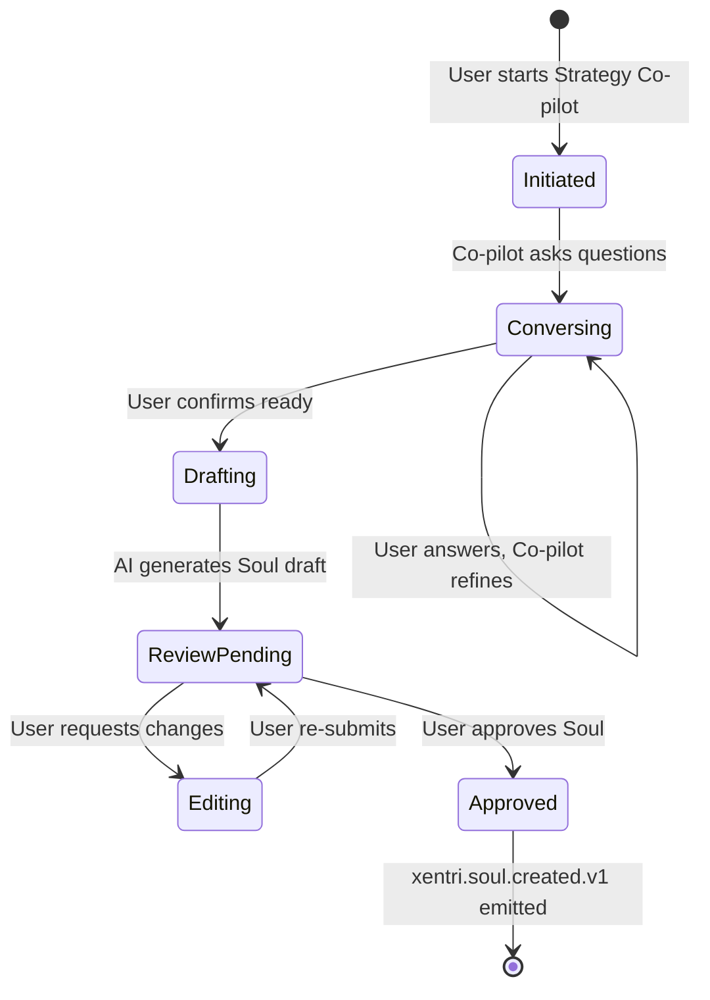
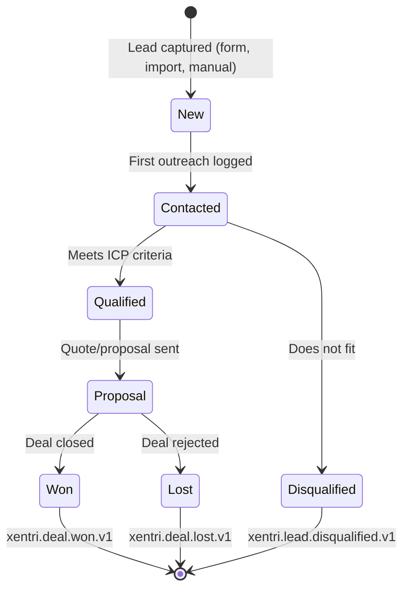
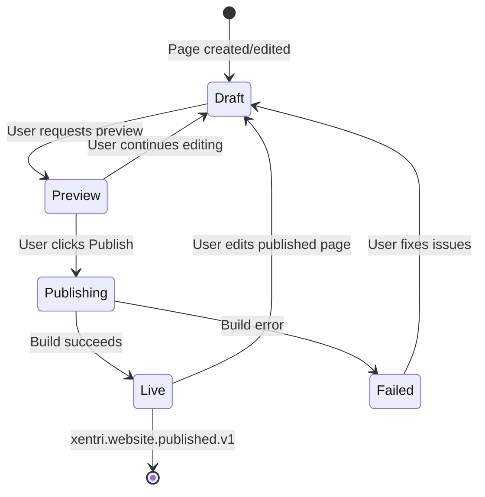

# Core API Architecture

> **Module:** core-api
> **Type:** Infrastructure Module
> **Parent:** Constitution Architecture (docs/platform/architecture.md)
> **Version:** 2.0

---

## Overview

The Core API service is the primary backend for Xentri, handling:

- Event persistence and querying
- Soul data management
- Authentication/authorization enforcement
- Multi-tenant data isolation via RLS

---

## Technology Stack

| Component | Technology    | Version  |
| --------- | ------------- | -------- |
| Runtime   | Node.js       | 24.x LTS |
| Framework | Fastify       | 5.x      |
| ORM       | Prisma        | 7.x      |
| Database  | PostgreSQL    | 16.x     |
| Auth      | Clerk         | 2.x      |
| Events    | Redis Streams | 8.x      |

---

## Service Architecture

```
┌─────────────────────────────────────────────────────────────┐
│                      Fastify Server                          │
├──────────────┬──────────────┬──────────────┬────────────────┤
│   Routes     │  Middleware  │   Services   │    Plugins     │
│  /api/v1/*   │  orgContext  │  eventService│   cors, auth   │
│              │  authGuard   │  soulService │   swagger      │
└──────┬───────┴──────┬───────┴──────┬───────┴────────────────┘
       │              │              │
       └──────────────┼──────────────┘
                      │
              ┌───────┴───────┐
              │ Prisma Client │
              └───────┬───────┘
                      │
              ┌───────┴───────┐
              │  PostgreSQL   │
              │   (with RLS)  │
              └───────────────┘
```

---

## Communication Patterns (The Nervous System)

> **Migrated from Constitution Architecture §6.C**

We prioritize **Indirect Communication** (Stigmergy/Events) to decouple modules, but allow **Direct Communication** for specific query needs.

### 1. Indirect (Default — "Fire and Forget")

- **Pattern:** Event-Driven Choreography
- **Transport:** Redis Streams
- **Use Case:** State changes, Workflow triggers, Cross-module actions
- **Example:** `Finance` emits `invoice.paid` → `Inventory` subscribes and decrements stock

### 2. Direct (Exception — "Ask and Wait")

- **Pattern:** Synchronous RPC (REST)
- **Transport:** HTTP/2
- **Use Case:** Real-time queries where eventual consistency is unacceptable
- **Example:** `Sales` calls `Inventory.check_stock(item_id)` before sending quote

### 3. Real-Time Collaboration (WebSockets)

- **Pattern:** Stateful WebSocket Connection
- **Transport:** `socket.io` (hosted in Node.js Tool Layer)
- **Use Case:** War Room (Multi-Agent + User Chat)
- **Example:** User enters War Room → Connects to `svc-tool-strategy` → Service bridges messages to Python Agents via Redis

### 4. Agent-to-Agent (Stigmergy)

- **Pattern:** Communication via State
- **Transport:** Database + Events
- **Example:** `Strategy` updates the Soul. `Marketing` sees the update and acts. They never "talk" directly.

---

## API & Error Conventions

> **Migrated from Constitution Architecture §6.D**

### Error Format (RFC 7807)

All errors follow Problem Details format:

```json
{
  "type": "https://xentri.io/errors/not-found",
  "title": "Resource Not Found",
  "status": 404,
  "detail": "Invoice with ID 123 not found",
  "trace_id": "abc-123-def"
}
```

### Auth Headers

- **User Auth:** JWT (Clerk) in HTTP-only cookie via `@clerk/fastify` middleware
- **Service Auth:** `Authorization: Bearer` for service-to-service calls
- **Org Context:** From JWT `org_id` claim; `x-org-id` header optional for org-switching

### Idempotency

For mutating endpoints that can retry, require `Idempotency-Key` header and persist to dedupe.

---

## Auth Patterns

> **Migrated from Constitution Architecture §6.E**

| Pattern          | Implementation                                                                                                                |
| ---------------- | ----------------------------------------------------------------------------------------------------------------------------- |
| **User Auth**    | Clerk for sign-in/up with native Organizations support. Access token includes `sub`, `org_id`, `org_role`, `org_permissions`. |
| **Social OAuth** | Multiple providers via Clerk (Google, Apple, Microsoft). MVP: Google + Apple.                                                 |
| **Service Auth** | Signed JWT with short TTL; verified per service; propagate `trace_id` and `org_id`.                                           |
| **Org Scoping**  | Middleware extracts `org_id` from Clerk JWT claims; RLS enforces at DB.                                                       |

---

## Naming Conventions

> **Migrated from Constitution Architecture §6.F**

| Type                | Pattern                                                           | Example                        |
| ------------------- | ----------------------------------------------------------------- | ------------------------------ |
| **API routes**      | `/api/v1/{service}/{resource}` (plural nouns)                     | `/api/v1/marketing/sites`      |
| **Events**          | `xentri.{boundedContext}.{action}.{version}`                      | `xentri.soul.updated.v1`       |
| **Database tables** | `snake_case` with `org_id`, `id` UUID, `created_at`, `updated_at` | `system_events`                |
| **Files**           | `services/{svc}/src/routes`, `services/{svc}/src/domain`          | `services/core-api/src/routes` |
| **Tests**           | Co-located as `*.test.ts` or `__tests__/`                         | `brief.test.ts`                |

---

## Lifecycle Patterns

> **Migrated from Constitution Architecture §6.G**

| Pattern              | Implementation                                                                                         |
| -------------------- | ------------------------------------------------------------------------------------------------------ |
| **Loading/Error UX** | Skeletons for primary content; inline errors with retry; toast for non-blocking                        |
| **Retries**          | Client retries idempotent GETs with backoff; mutations use idempotency keys                            |
| **Background Jobs**  | Event handlers must be idempotent; retries with exponential backoff; dead-letter to `redis:stream:dlq` |

---

## Multi-Tenant Isolation (PR-001)

Every request includes `org_id` from JWT claims:

```typescript
// Middleware extracts org_id from Clerk JWT
const orgId = req.auth.orgId;

// All queries automatically scoped
const events = await prisma.systemEvent.findMany({
  where: { org_id: orgId },
});
```

RLS policies enforce isolation at the database level as a defense-in-depth measure.

---

## Event-First Architecture (PR-002)

All mutations emit events before returning:

```typescript
async function createInvoice(data) {
  // 1. Write to system_events first
  await eventService.emit({
    type: 'xentri.finance.invoice.created.v1',
    payload: data,
  });

  // 2. Then write to domain table
  return prisma.invoice.create({ data });
}
```

---

## State Machines for Complex Flows

> **Migrated from Constitution Architecture §10**

### Soul Generation Flow



**States:**

- `Initiated` — Session started, no data yet
- `Conversing` — Multi-turn Q&A active
- `Drafting` — AI processing, generating sections
- `ReviewPending` — Draft complete, awaiting user review
- `Editing` — User making manual edits
- `Approved` — Final, triggers downstream modules

### Lead Lifecycle Flow



### Website Publish Flow



---

## Testing Strategy

> **Migrated from Constitution Architecture §5**

| Category        | Framework                        | Scope                             | Threshold    |
| --------------- | -------------------------------- | --------------------------------- | ------------ |
| **Unit**        | Vitest                           | Pure functions, schemas, utils    | 70% coverage |
| **Integration** | Vitest + Testcontainers          | DB operations, RLS, API routes    | Per-module   |
| **Contract**    | Pact + JSON Schema diff          | Node ↔ Python schema parity      | CI gate      |
| **Smoke**       | Custom (`scripts/smoke-test.ts`) | RLS isolation, event immutability | CI gate      |
| **Load**        | k6                               | Performance under concurrency     | Pre-release  |

### Load Testing Baselines

| Test Type | Tool | Baseline              | Threshold                                 | Frequency   |
| --------- | ---- | --------------------- | ----------------------------------------- | ----------- |
| **Load**  | k6   | 100 concurrent users  | p95 < 300ms (reads), p95 < 600ms (writes) | Pre-release |
| **Soak**  | k6   | 50 users for 1 hour   | No memory leak, latency stable            | Monthly     |
| **Spike** | k6   | 10 → 200 users in 10s | Graceful degradation, no 5xx cascade      | Quarterly   |

### Test Naming Conventions

| Pattern                 | Usage                   | Example                     |
| ----------------------- | ----------------------- | --------------------------- |
| `*.test.ts`             | Unit tests (co-located) | `brief.test.ts`             |
| `*.integration.test.ts` | Integration tests       | `brief.integration.test.ts` |
| `*.contract.test.ts`    | Contract tests          | `events.contract.test.ts`   |

---

## Health Endpoints

| Endpoint              | Purpose                              |
| --------------------- | ------------------------------------ |
| `GET /health`         | Liveness — returns `{"status":"ok"}` |
| `GET /health/ready`   | Readiness — includes DB ping         |
| `GET /api/v1/metrics` | Process metrics (no auth)            |

---

## Observability

| Component   | Technology    | Purpose                                                |
| ----------- | ------------- | ------------------------------------------------------ |
| **Logging** | Pino JSON     | Structured logs with `trace_id`, `org_id`, `user_id`   |
| **Tracing** | OpenTelemetry | Auto-instrumentation; `traceparent` header propagation |
| **Errors**  | Sentry        | When `SENTRY_DSN` set; scrubbed headers                |
| **Metrics** | Prometheus    | Process uptime, memory, load                           |

---

## Internationalization (i18n)

> **Migrated from Constitution Architecture §7**

| Layer       | Solution                             |
| ----------- | ------------------------------------ |
| Backend     | `Accept-Language` aware responses    |
| Translation | DeepL API (free tier: 500k chars/mo) |

### Language Resolution Order

1. User's explicit preference (Settings)
2. Browser `Accept-Language` header
3. IP geolocation
4. Org's default language
5. Fallback: English

---

## DLQ Monitoring & Recovery

> **Migrated from Constitution Architecture §7**

| Stream       | Alert Threshold         | Response                                  |
| ------------ | ----------------------- | ----------------------------------------- |
| `jobs:dlq`   | > 10 messages in 1 hour | Page on-call; investigate flow failures   |
| `events:dlq` | > 5 messages in 1 hour  | Page on-call; check consumer health       |
| `sync:dlq`   | > 20 messages in 1 hour | Alert (non-urgent); batch retry overnight |

### Replay Procedures

```bash
# List DLQ messages
redis-cli XRANGE jobs:dlq - + COUNT 10

# Replay single message to original stream
redis-cli XADD jobs:work MAXLEN ~10000 * [fields from DLQ message]

# Bulk replay (use with caution)
./scripts/dlq-replay.sh jobs:dlq jobs:work --batch 50
```

### Poison Message Handling

1. Messages that fail 3x go to DLQ
2. After 24 hours in DLQ without intervention, archive to `dlq:archive:{stream}:{date}`
3. Archive retained for 30 days for forensics
4. Alert if same `correlation_id` appears in DLQ 3+ times (systemic issue)

---

## Cache Invalidation Map

| Resource | Cache Key                 | Invalidation Event                                 |
| -------- | ------------------------- | -------------------------------------------------- |
| Soul     | `soul:{org_id}`           | `xentri.soul.updated.v1`                           |
| Site     | `site:{org_id}:{site_id}` | `xentri.website.published.v1`                      |
| Leads    | `leads:list:{org_id}`     | `xentri.lead.created.v1`, `xentri.lead.updated.v1` |

---

## Directory Structure

```
services/core-api/
├── src/
│   ├── routes/           # API route handlers
│   ├── services/         # Business logic
│   ├── middleware/       # Request middleware
│   ├── plugins/          # Fastify plugins
│   └── index.ts          # Server entry point
├── prisma/
│   ├── schema.prisma     # Database schema
│   └── migrations/       # Migration history
└── tests/
    ├── unit/
    └── integration/
```

---

## Related Documents

- [Core API PRD](./prd.md) — Functional requirements
- [Core API Epics](./epics.md) — Implementation stories
- [Constitution Architecture](../architecture.md) — System-wide decisions
- [TS Schema](../ts-schema/prd.md) — Shared type contracts

---

## Document History

| Version | Date       | Author  | Changes                                                         |
| ------- | ---------- | ------- | --------------------------------------------------------------- |
| 1.0     | 2025-12-03 | —       | Initial scaffold                                                |
| 2.0     | 2025-12-03 | Winston | Migrated implementation patterns from Constitution Architecture |
