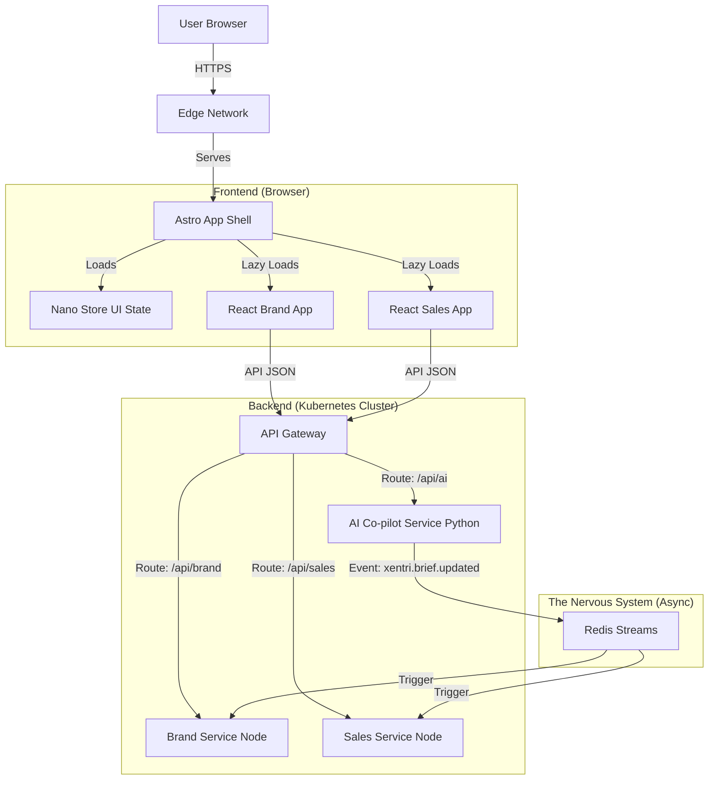
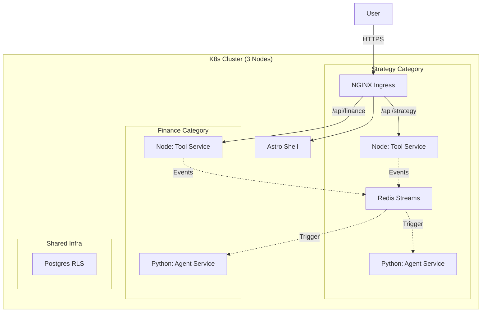
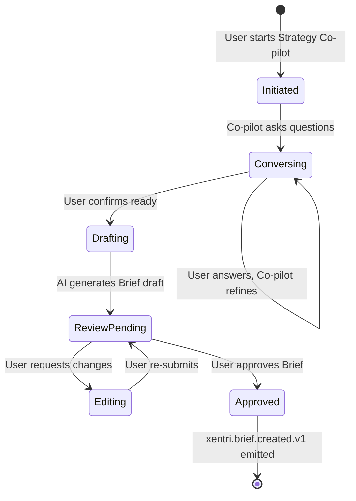
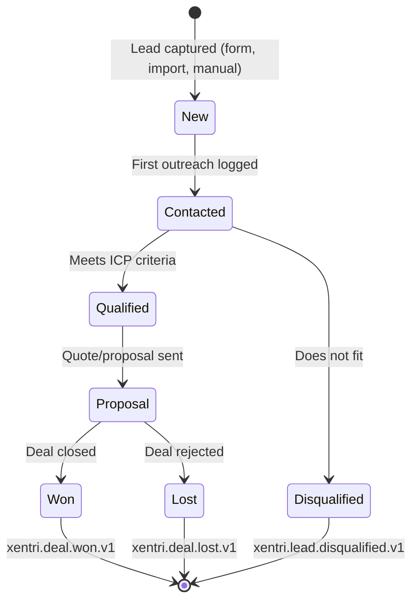
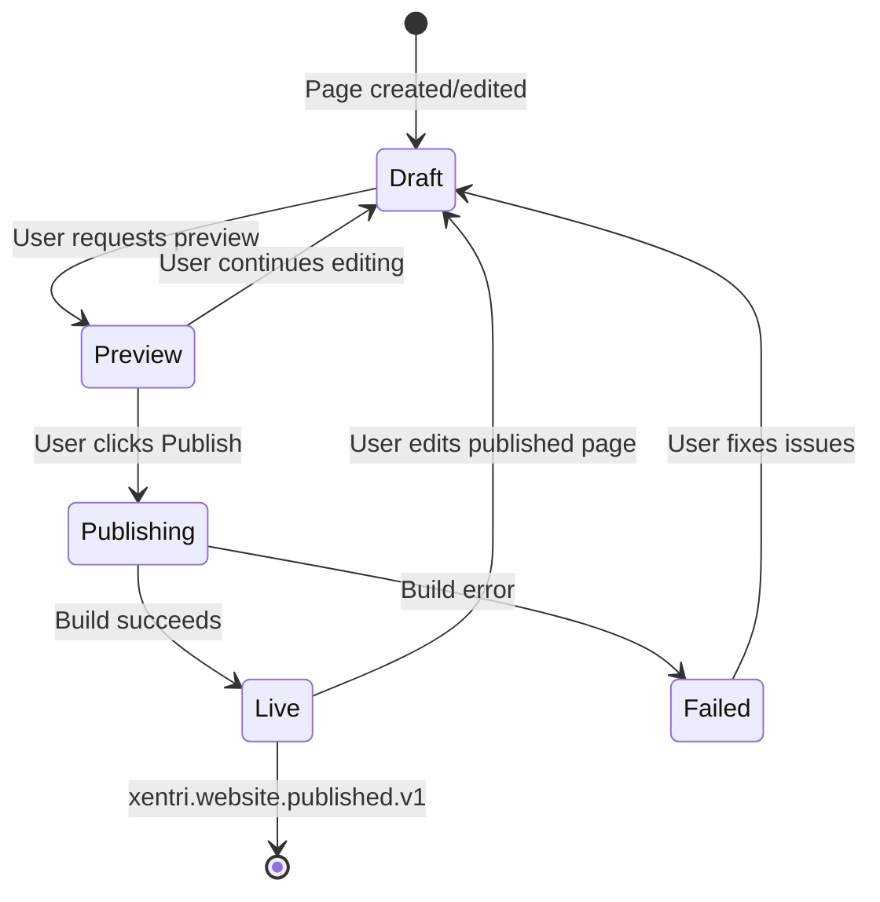
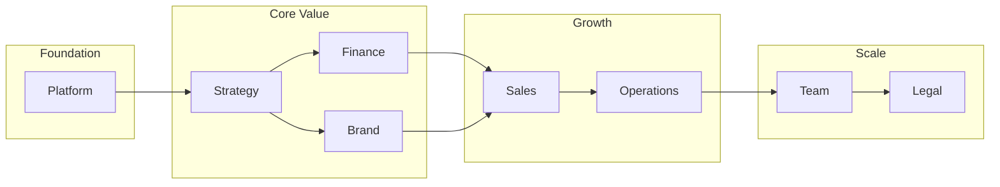

# Xentri Architecture

> **Status:** Draft
> **Version:** 2.3.0
> **Last Updated:** 2025-12-01

## 1. Executive Summary

Xentri is a **Fractal Business Operating System** orchestrated by a hierarchical network of autonomous AI agents. It starts with a Strategy Co-pilot conversation generating a Strategy Brief (the DNA of the business), which then guides downstream agents (Marketing, Sales, Finance) who manage their own specialized categories, sub-categories and individual modules/tools. The architecture employs a Turborepo monorepo with an Astro Shell at the core, hosting React SPAs, and a **Hybrid Backend** (Node.js for Tools, Python for Agents, to start with).

### Core Architectural Principles

| Principle | Description |
|-----------|-------------|
| **Decoupled Unity** | Eg. Unified Shell (Astro) for seamless UX; isolated Micro-Apps (React), Tool Services (Node.js), and Agent Services (Python) for technical independence |
| **Event-Driven Backbone** | Services communicate via immutable events through Redis—no direct coupling; new modules integrate without rewrites |
| **Multi-Tenancy by Design** | Single Postgres cluster with RLS enforces "Client Zero" data isolation from day one |
| **Reality-In Data** | Ingest messy inputs (voice, text) and progressively structure them—no rigid forms upfront |

---

## 2. High-Level Architecture

We employ a **Monorepo** structure managed by **Turborepo**.

### The Stack

| Layer | Technology | Role |
| :--- | :--- | :--- |
| **Shell** | **Astro** | The container application. Handles routing, auth, layout, and "Islands" orchestration. |
| **Micro-Apps** | **React** | Interactive capabilities (CRM, CMS, etc.) loaded as "Islands" within the Shell. |
| **Backend** | **Node.js** | Dockerized microservices for business logic (Sales, Finance, etc.). |
| **Agent Layer** | **Python** | **Reasoning & Intelligence.** Powers the ~42 complex Agents (7 Category Co-pilots + 35 Sub-Category Agents). |
| **Data** | **Postgres** | Single cluster with **RLS** for multi-tenancy. |
| **Events** | **Redis** | The "Nervous System" transport layer for high-volume synchronization. |

### Decision Summary Table

| Category | Decision | Version | Rationale |
| :--- | :--- | :--- | :--- |
| Shell | Astro shell with React islands | Astro 5.16.0 / React 19.2.0 | Hybrid SSR/SSG with island hydration; stable React ecosystem for micro-apps. |
| Monorepo Tooling | Turborepo + pnpm workspaces | Turbo 2.6.1 / pnpm 10.23.0 | Fast incremental builds and deterministic installs across apps/services/packages. |
| Backend Runtime & API | Node.js + Fastify REST APIs | Node 24.11.1 LTS / Fastify 5.6.2 | Current LTS for runtime security; schema-first, high-performance JSON APIs. |
| Database & ORM | Postgres with Prisma | Postgres 16.11 / Prisma 7.0.1 | Typed queries with RLS support; aligns with event log and multi-tenant policies. |
| AuthN/AuthZ | Clerk + JWT cookies | @clerk/fastify 3.x / @clerk/astro 1.x | Delegates identity with native Organizations support; email/OAuth/SSO; multi-tenant JWT claims (org_id, role) out of the box. |
| Billing/Subscriptions | Clerk Billing (Stripe-backed) | Clerk Billing 1.x | Unified auth+billing; subscriptions tied to Clerk Organizations; supports module-based pricing model. (v0.4 scope) |
| Events & Transport | Postgres `system_events` log + Upstash Redis Streams | Upstash Redis (managed) | Durable source-of-truth log with pay-per-request streaming; scales from zero to millions. |
| File/Object Storage | S3-compatible blobs (prod: AWS S3, local: MinIO) | MinIO 8.0.6 client (server RELEASE.2024-09-30) | Presigned uploads for media/assets; CDN-friendly and infra-portable. |
| Deployment Target | Managed Kubernetes | k8s 1.31.0 | Standardized runtime for services, HPA-ready, secrets and ingress consistency. |
| Observability | OpenTelemetry traces + Pino JSON logs to Loki/Grafana | OTel SDK 1.9.0 / Pino 10.1.0 | Trace propagation across shell/services; structured logs for debugging. |

Version check date: 2025-11-26 (re-verify with WebSearch before releases).

### Version Compatibility Notes

| Technology | Compatibility Consideration |
|------------|----------------------------|
| **Node 24.x → 26.x** | Watch for ESM-only changes in core modules; test `--experimental-*` flags before upgrade |
| **Prisma 7.x** | Breaking: new migration format from v6; run `prisma migrate diff` before upgrading existing DBs |
| **Astro 5.x → 6.x** | Island hydration API may change; audit `client:*` directives |
| **React 19.x** | Concurrent features stable; Actions API replaces some form patterns—audit form handlers |
| **Fastify 5.x** | Plugin API stable; watch for hook signature changes in minors |
| **Redis 8.x** | Streams API stable; ACL syntax changed from v7—update connection configs if upgrading |

**Upgrade Protocol:** Before any major version bump: (1) check release notes for breaking changes, (2) run full test suite in staging, (3) update `ts-schema` contracts if API shapes change.

### System Diagram



---

## 3. Architecture Decision Records (ADRs)

### ADR-001: Universal Brief Orchestration (Knowledge Hierarchy)

**Context:** How do we ensure the "Universal Brief" effectively powers diverse downstream modules without creating a tight coupling or a "god object"?

**Decision:** We adopt a **Knowledge Hierarchy** pattern.

1. **Universal Brief:** The shared source of truth (Identity, Offerings, Goals). Accessible by all Category Agents.
2. **Category Context:** Domain-specific rules derived from the Brief (e.g., Brand Voice, Sales Pipeline). Managed by Category Agents.
3. **Module Context:** Specific configurations (e.g., Website Pages, Quote Templates). Managed by Subagents.

**Implication:** Agents must first consult the Universal Brief, then their Category Context, before taking action.

### ADR-002: Event Envelope & Schema

**Context:** To prevent the "Nervous System" from becoming a swamp of untyped JSON, we need a strict event contract.

**Decision:** We enforce a strict `SystemEvent` envelope with namespaced types, versioning, and PII hygiene.

```typescript
type ISO8601 = string;

interface SystemEvent<TPayload = unknown> {
  id: string;                        // UUID (immutable)
  type: string;                      // e.g., "xentri.brief.updated"
  occurred_at: ISO8601;              // Business time
  
  org_id: string;                    // Tenant Context
  actor: { 
    type: "user" | "system" | "job"; 
    id: string 
  };

  envelope_version: "1.0";
  payload_schema: string;            // e.g., "brief.updated@2.1"
  payload: TPayload;                 // The facts, not the full DB dump

  // Reliability & Tracing
  dedupe_key?: string;               // Idempotency key
  correlation_id?: string;           // Workflow/Thread ID
  trace_id?: string;                 // Distributed Trace ID

  meta: {
    source: string;                  // e.g., "strategy-co-pilot"
    environment?: "local" | "staging" | "prod";
  };
}
```

**Implication:** All services must use the shared `packages/ts-schema` to validate events before emitting.

### ADR-003: Multi-Tenant Security (RLS & Context)

**Context:** We must ensure strict data isolation between organizations in a shared database.

**Decision:** We use **Postgres Row-Level Security (RLS)** with a **Fail-Closed** transaction pattern.

1. **Transport:** Client sends `x-org-id` header.
2. **Gate:** Middleware verifies `user_id` (from JWT) is a member of `x-org-id`. Rejects if false.
3. **Transaction:** Service executes `SELECT set_config('app.current_org_id', $1, true)` at the start of the transaction. The `true` flag ensures the setting is **transaction-scoped** (equivalent to `SET LOCAL`), preventing connection pool leakage.
4. **Enforcement:** RLS policies explicitly check for the presence of the variable and fail closed if missing.

```sql
-- Example Policy (Fail Closed)
CREATE POLICY tenant_isolation ON some_table
USING (
  current_setting('app.current_org_id', true) IS NOT NULL
  AND org_id = current_setting('app.current_org_id', true)::uuid
);
```

### ADR-008: Python for Agent Layer

**Context:** The Module Matrix revealed 175 modules. ~130 are standard business tools (CRUD, Lists, Forms), while ~42 are complex AI agents (Category + Sub-Category levels). Using Python for everything kills frontend velocity (no shared types). Using Node for everything kills AI velocity (inferior LLM/Data libs).

**Decision:** We introduce a dedicated **Python Agent Layer** for all complex AI agents.

* **Scope:** Heavy Reasoning, LLM Chains, Data Science, Complex Agents.
* **Why:** Native home of AI (LangChain, PyTorch, Pandas).
* **Example:** `Strategy Co-pilot` (Category), `Soul Agent` (Sub-Category), `Negotiator`.

**Implication:** This creates a clear boundary between business logic (Node.js) and AI logic (Python), allowing each to leverage its ecosystem strengths. Communication between layers is strictly via the "Nervous System" (Redis Streams) and defined API contracts.

### ADR-006: Tri-State Memory Architecture

**Context:** "Context Window" is expensive and ephemeral. Agents need long-term memory that mimics human recall (Facts, Experiences, Persona).

**Decision:** We implement a **Tri-State Memory System**:

1. **Semantic Memory (The Brief):**
    * **What:** Structured facts about the business (Identity, Offerings, Goals).
    * **Storage:** Postgres (JSONB) + Redis Cache.
    * **Access:** Read-Heavy. Every Agent reads this before acting.

2. **Episodic Memory (The Journal):**
    * **What:** Time-series log of *what happened* (decisions, outcomes, conversations).
    * **Storage:** Vector Database (pgvector).
    * **Access:** Search-Heavy. "Have I dealt with this client before?"

3. **Synthetic Memory (The Persona):**
    * **What:** Compressed "Wisdom" derived from episodes.
    * **Storage:** System Prompt (Text).
    * **Access:** Load-Heavy. Injected into every LLM context.

**Implication:** We need a background "Dreaming" process (Python) that runs nightly to compress Episodes into Synthetic Memory (e.g., "Client X prefers email over phone").

**Dreaming Process Specification:**

* **Trigger:** Nightly Cron job (02:00 local time) managed by the Category Copilot.
* **Resilience:**
  * **Retry:** 3 retries with exponential backoff.
  * **Failure:** If all retries fail, emit a P3 incident alert to the Event Spine. The system continues to function with "stale" Synthetic Memory until the next successful run.

### ADR-007: Federated Soul Registry

**Context:** We have 42 Agents. Managing 42 separate system prompts is impossible.

**Decision:** We use a **Federated Prompt Composition** strategy.

* **Layer 1: The Global Soul (DNA):** Universal values (Calm, Clarity, Truth). Shared by ALL agents.
* **Layer 2: The Category Context:** Domain expertise (e.g., "I am a Strategist"). Shared by Category Agents.
* **Layer 3: The Agent Role:** Specific job (e.g., "I analyze KPIs"). Unique to the Agent.

**Composition:** `Final Prompt = Global Soul + Category Context + Agent Role + Universal Brief`.

---

### ADR-004: Kubernetes First (The "Category Cluster" Strategy)

**Context:** We currently have ~42 Agents and ~130 Tools planned. Deploying them as ~175 separate services on a PaaS (Railway) is cost-prohibitive and unmanageable.

**Decision:** We deploy to **Managed Kubernetes** (e.g., GKE) from Day 1.

**Topology: The "Category Consolidation" Pattern**
Instead of 175 microservices, we group workloads by **Category** to balance isolation with management overhead.

> **Why not 42 separate Pods on Autopilot?**
> GKE Autopilot charges for a minimum of 250m vCPU and 512MiB Memory per Pod. Deploying 42 separate agents would result in ~10.5 vCPU of *minimum* idle cost. Consolidating into 7 Category Services allows us to share resources efficiently and avoid this "Pod Tax".

1. **Agent Plane (Python):** **7 Deployments** (1 per Category).
    * Each Pod hosts the **Category Co-pilot** + its **5 Sub-Category Agents**.
    * *Example:* `svc-agent-strategy` runs `StrategyCoPilot`, `SoulAgent`, `PulseAgent`, etc.
    * *Scale:* 1 Replica per Category (Vertical Scaling).

2. **Tool Plane (Node.js):** **7 Deployments** (1 per Category).
    * Each Pod hosts the **API endpoints** for that Category's 5 Sub-categories.
    * *Example:* `svc-tool-finance` handles Invoicing, Ledger, Payroll APIs.
    * *Scale:* Horizontal Scaling (HPA) based on traffic.

3. **Frontend Plane:**
    * **Shell:** 1 Deployment (Astro SSR).
    * **Micro-Apps:** Served as static assets via Nginx/CDN.

**Total Services:** ~15 (7 Agents + 7 Tools + 1 Shell).
**Infrastructure Cost:** ~$40-80/mo (3 Nodes).

**Implication:** We need a Helm Chart template that can be instantiated 7 times.

#### Horizontal Agent Scaling Triggers

The "Category Consolidation" pattern uses vertical scaling initially. Split to horizontal when:

| Trigger | Signal | Action |
|---------|--------|--------|
| **p95 latency > 2s** | Agent responses consistently slow | Add replica, load-balance requests |
| **Memory > 80%** | Pod OOMKilled or near limit | Vertical scale first, then horizontal |
| **Queue depth > 50** | Agent requests backing up | Add replica with sticky routing |
| **Category isolation needed** | One sub-agent causing instability | Extract to dedicated pod |

**Split Protocol:**

1. Identify bottleneck sub-agent via tracing
2. Create dedicated deployment for that agent
3. Update service mesh routing
4. Monitor for 1 week before removing from consolidated pod

**Target state (at scale):** 7 Category Co-pilots stay consolidated. Sub-agents split as needed based on usage patterns.

### ADR-009: Cross-Runtime Contract Strategy

**Context:** `ts-schema` is our contract source of truth, but Python services can't consume TypeScript directly. Without explicit validation, the Node ↔ Python boundary becomes a "trust zone" where schema drift is inevitable.

**Decision:** We use a **JSON Schema Bridge** for cross-runtime contract enforcement.

**Generation Pipeline:**

```ts
ts-schema (Zod)
  → zod-to-json-schema
  → schemas/*.json
  → datamodel-codegen (Python)
  → py-schema/*.py
```

**Schema Versioning Protocol:**

1. **Bump version** on breaking changes: `brief.updated@2.1` → `brief.updated@3.0`
2. **N-1 support:** Python services must handle previous version during migration window
3. **Deprecation:** 30 days notice before removing old version support

**Contract Testing:**

| Layer | Tool | Purpose |
|-------|------|---------|
| Schema parity | JSON Schema diff in CI | Generated schemas match across runtimes |
| Runtime validation | Pact (consumer-driven) | Python consumers validate against Node providers |
| Integration | Vitest + pytest | Round-trip: Node emits → Redis → Python consumes → validates |

**Implication:** CI enforces `pnpm run generate:schemas` on any `ts-schema` change. Custom Zod validators (`.refine()`) don't auto-translate—require manual integration tests.

### ADR-011: Hierarchical Pulse Architecture

**Context:** The UX design requires that every level of the hierarchy (Strategy, Category, Sub-category, Module) exposes its own Pulse view. This enables CEO-level briefings at the top and operational detail at the bottom.

**Decision:** We implement a **Fractal Pulse System** where each hierarchy level produces and consumes Pulse data.

**Pulse Hierarchy:**

| Level | Pulse View | Content | Audience |
|-------|------------|---------|----------|
| **Strategy Pulse** | What survived all 4 layers of filtering | CEO briefing — cross-domain synthesis | Owner/Founder |
| **Category Pulse** | What's happening in that category | Department head view | Category managers |
| **Sub-category Pulse** | What's happening in that sub-category | Team lead view | Sub-category owners |
| **Module Pulse** | What's happening in that specific module | Operational view | Module users |

**Landing Logic:**

1. User lands on their **highest-level available** Pulse based on permissions
2. Multi-scope users land on **most recently used** scope (tracked in user session)
3. Owner/Founder lands on Strategy Pulse by default

**Pulse Data Structure (ts-schema):**

```typescript
interface PulseItem {
  id: string;
  scope: PulseScope;                    // strategy | category.{name} | subcategory.{name} | module.{name}
  source_event_id: string;              // Link to originating event
  importance: 1 | 2 | 3 | 4 | 5;        // 1 = highest
  title: string;
  summary: string;
  action_required: boolean;
  action_url?: string;
  expires_at?: string;                  // ISO8601 — auto-dismiss after
  created_at: string;
  promoted_from?: string;               // If escalated from child scope
}

type PulseScope =
  | 'strategy'
  | `category.${string}`
  | `subcategory.${string}`
  | `module.${string}`;
```

**API Endpoints:**

| Endpoint | Purpose |
|----------|---------|
| `GET /api/v1/pulse/{scope}` | Get Pulse items for a specific scope |
| `GET /api/v1/pulse/landing` | Get user's landing Pulse (respects permissions + last used) |
| `POST /api/v1/pulse/{scope}/dismiss/{id}` | Dismiss a Pulse item |
| `PUT /api/v1/users/me/last-scope` | Update user's last used scope |

**Promotion Logic (Escalation):**

When a child agent determines an item should surface to a parent:

1. Child emits event with `promote_to: "parent"` flag
2. Parent agent receives, re-evaluates importance in parent context
3. If still important, creates new PulseItem at parent scope with `promoted_from` reference
4. Original item remains at child scope (user can drill down)

**Implication:** Each agent level (Strategy, Category, Sub-category, Module) must implement Pulse output generation. The Python Agent Layer processes events and produces Pulse items as part of its synthesis cycle.

---

### ADR-012: Copilot Widget Architecture

**Context:** The UX design specifies a draggable widget that summons the context-relevant copilot, supporting both quick answers and full interaction modes.

**Decision:** We implement a **Context-Aware Copilot Widget** as a Shell-level component.

**Widget States:**

| State | Appearance | Behavior |
|-------|------------|----------|
| **Collapsed** | Small icon + notification badge | User-positionable, persists position |
| **Panel** | Right or bottom panel (user choice) | Shares screen with SPA content |
| **Full** | Replaces main section | SPA content hidden, full copilot focus |

**Context Resolution:**

The widget determines which copilot to summon based on navigation context:

```typescript
interface CopilotContext {
  scope: 'strategy' | 'category' | 'subcategory' | 'module';
  category?: string;
  subcategory?: string;
  module?: string;
}

// Resolution order:
// 1. Current route → extract scope
// 2. Load copilot for that scope
// 3. Pass current Brief section + recent events as context
```

**Widget State Persistence:**

| State | Storage | Scope |
|-------|---------|-------|
| Position (x, y) | localStorage | Per device |
| Preferred mode (panel/full) | User preferences table | Per user |
| Collapsed/expanded | Session storage | Per session |

**Copilot Response Modes:**

| Mode | Trigger | Behavior |
|------|---------|----------|
| **Quick Answer** | Short question, collapsed widget | Streaming text in small overlay |
| **Full Interaction** | Complex question, panel/full mode | Full chat interface with history |

**Notification Badge Logic:**

Badge shows count of:

* Unread copilot suggestions for current scope
* Pending recommendations awaiting user action
* Clears on widget open

**Implication:** Shell must track navigation context and pass it to the widget. Copilot services must support both streaming (quick) and full conversation (stateful) modes.

---

### ADR-010: Resilience & Graceful Degradation

**Context:** The architecture assumes everything works. It doesn't specify behavior when things fail. This ADR establishes resilience patterns.

**Decision:** We implement a 3-tier resilience strategy: Rate Limiting, Graceful Degradation, and Chaos Testing.

#### Rate Limiting (3-Tier)

| Layer | Strategy | Implementation |
|-------|----------|----------------|
| API Gateway/Ingress | Global rate limit per org | NGINX `limit_req_zone` (100 req/s/org) |
| Service Layer | Per-endpoint limits | Fastify `@fastify/rate-limit` plugin |
| Copilot Layer | Token budget per org | Track in Redis, enforce before LLM call |

**Rate Limit Response Format:**

```json
{
  "type": "https://xentri.com/problems/rate-limited",
  "title": "Too Many Requests",
  "status": 429,
  "detail": "Org limit: 100 req/s. Retry after 1.2s.",
  "retry_after": 1.2,
  "limit": 100,
  "remaining": 0,
  "reset": "2025-12-01T21:00:00Z"
}
```

Standard headers: `X-RateLimit-Limit`, `X-RateLimit-Remaining`, `X-RateLimit-Reset`.

#### Graceful Degradation Matrix

| Scenario | User Experience | Technical Behavior |
|----------|-----------------|-------------------|
| **Token budget exhausted** | "Your assistant is on a break. Continue on your own or wait until {time} when they'll be back online." | Copilot returns 503 with `next_available` timestamp (calculated from reset schedule: 6am, 12pm, 6pm, 12am in user timezone) |
| **Agent service crash** | "Your assistant is temporarily unavailable. You can continue working—changes will sync when they return." | Tools remain functional; copilot endpoints return 503 without time estimate |
| **Redis down** | "Syncing paused. Changes will sync when connection restores." | Events queue locally in service; write-through to Postgres; reconnect with exponential backoff |
| **Postgres read replica lag** | Transparent to user | Route reads to primary for critical paths |

**Principle:** Tools must never depend on Agents to function. Events may delay, but CRUD must work.

#### Chaos Testing Patterns

| Test | Trigger | Expected Behavior | Blast Radius |
|------|---------|-------------------|--------------|
| Redis disconnect | Kill Redis pod | Services queue events locally, reconnect | Should break: Event delivery. Must NOT break: CRUD, auth |
| Agent service crash | SIGKILL Python pod | Tools continue, 503 on copilot routes | Should break: Copilot responses. Must NOT break: Tool APIs |
| Slow Postgres | `pg_sleep` injection | Timeouts trigger circuit breaker | Should break: Slow queries. Must NOT break: Cached reads |
| Network partition | NetworkPolicy deny | Services degrade gracefully | Should break: Cross-service calls. Must NOT break: Local operations |

**Frequency:** Redis/Agent tests weekly on staging. Postgres/Network tests monthly. Each test links to incident runbook.

**Tooling:** Start with manual scripts in `scripts/chaos/`. Consider Chaos Mesh for GKE at scale (>100 orgs).

**Implication:** Every service must implement local event queuing. Shell HTTP client must auto-backoff on `retry_after`.

---

## 4. Project Structure

```text
/xentri
├── /apps/shell              # Astro Shell (The Container)
├── /packages
│   ├── /ui                  # Shared React Components
│   └── /ts-schema           # Shared Types (Events, API)
├── /services
│   ├── /core-api            # Node.js: Auth, Orgs, Billing
│   ├── /strategy-copilot    # [NEW] Python: Strategy Agent
│   │   ├── /src
│   │   │   ├── /agent       # Agent definition (LangGraph)
│   │   │   ├── /tools       # Agent tools
│   │   │   ├── /memory      # Memory interfaces
│   │   │   └── /api         # (Fast)API routes
│   │   ├── /tests
│   │   └── pyproject.toml
│   └── /brand-copilot       # [NEW] Python: Brand Agent
└── /docs                    # Documentation
```

Future services (brand-engine, sales-engine, ai-service, n8n-host) follow the same pattern.

### Contract Source of Truth

All shared types live in `packages/ts-schema`:

* `api.ts` — API envelope and Problem Details
* `auth.ts` — User and service JWT claims
* `events.ts` — Event envelope and actor/meta

CI runs `tsc` against these definitions to prevent drift.

---

## 5. Infrastructure & Operations

### Deployment Architecture (Kubernetes)

We use a **Category-Based Topology** to manage the 175+ modules efficiently.



### Service Map

| Service Name | Runtime | Scope | Replicas |
| :--- | :--- | :--- | :--- |
| `shell` | Node/Astro | Global UI Container | 2 (HPA) |
| `svc-tool-strategy` | Node.js | Strategy Tools (Mission, KPIs, OKRs) | 2 (HPA) |
| `svc-agent-strategy` | Python | Strategy Agents (Co-pilot, Soul, Pulse) | 1 (Vertical) |
| `svc-tool-finance` | Node.js | Finance Tools (Invoices, Ledger) | 2 (HPA) |
| `svc-agent-finance` | Python | Finance Agents (CFO, Auditor) | 1 (Vertical) |
| ... (Repeat for all 7 Categories) | | | |

### WebSocket Ingress Configuration

For real-time collaboration (War Room), WebSocket connections require specific Ingress annotations:

```yaml
# ingress.yaml annotations for WebSocket support
apiVersion: networking.k8s.io/v1
kind: Ingress
metadata:
  annotations:
    nginx.ingress.kubernetes.io/proxy-read-timeout: "3600"
    nginx.ingress.kubernetes.io/proxy-send-timeout: "3600"
    nginx.ingress.kubernetes.io/upstream-hash-by: "$request_uri"
    nginx.ingress.kubernetes.io/proxy-http-version: "1.1"
    nginx.ingress.kubernetes.io/use-regex: "true"
    # WebSocket upgrade headers
    nginx.ingress.kubernetes.io/configuration-snippet: |
      proxy_set_header Upgrade $http_upgrade;
      proxy_set_header Connection "upgrade";
spec:
  rules:
    - host: app.xentri.com
      http:
        paths:
          - path: /ws/.*
            pathType: Prefix
            backend:
              service:
                name: svc-tool-strategy  # War Room hosted here
                port:
                  number: 3000
```

**Sticky Sessions:** For socket.io, ensure `upstream-hash-by` routes same client to same pod.

### Deployment Target (GCP Native)

We standardize on **Google Cloud Platform (GCP)** for the "Client Zero" implementation.

* **Compute:** **GKE Autopilot** (Recommended).
  * *Why:* **Serverless K8s.** Google manages nodes, security, and scaling. We pay only for the CPU/RAM our Agents use, not for idle servers. Perfect for a "Solo Visionary" team (Zero Ops).
* **Database:** **Cloud SQL for PostgreSQL** (Private IP).
* *Why:* Managed backups, HA, automatic patches. **Crucial:** Low latency to GKE via VPC Peering.
* **Events/Cache:** **Cloud Memorystore for Redis** (Private IP).
  * *Why:* Managed high availability for the "Nervous System".
* **Storage:** **Google Cloud Storage (GCS)**.
  * *Why:* Unified permissions (Workload Identity).

**Cost Optimization (Startup):**

* Use **Spot Instances** for the Agent Node Pool (Agents are fault-tolerant).
* Use **Cloud SQL Shared Core** (e.g., `db-f1-micro`) for dev/staging.

### Environment Plan

* **Local (docker compose):** Postgres 16, Redis 7, MinIO.
* **Staging (GCP):** GKE (1 Node), Cloud SQL (Micro), Memorystore (Basic).
* **Production (GCP):** GKE (3 Nodes), Cloud SQL (HA), Memorystore (Standard HA).

### Key Constraints

| Constraint | Rationale |
|------------|-----------|
| **Docker-first** | All services via Dockerfile—no Nixpacks. Ensures K8s portability. |
| **Redis with Volume** | Streams require persistence. Pin version ≥7.x. |

### Testing Strategy

| Category | Framework | Scope | Threshold |
|----------|-----------|-------|-----------|
| **Unit** | Vitest | Pure functions, schemas, utils | 70% coverage |
| **Integration** | Vitest + Testcontainers | DB operations, RLS, API routes | Per-module |
| **Contract** | Pact + JSON Schema diff | Node ↔ Python schema parity | CI gate |
| **Smoke** | Custom (`scripts/smoke-test.ts`) | RLS isolation, event immutability, health | CI gate |
| **Load** | k6 | Performance under concurrency | Pre-release gate |
| **E2E** | Playwright (planned) | Full user flows | Future |

**Coverage scope:** `src/lib/**`, `src/middleware/**`, `src/routes/health.ts`. Domain/infra excluded until integration tests mature.

#### Load Testing Baseline

| Test Type | Tool | Baseline | Threshold | Frequency |
|-----------|------|----------|-----------|-----------|
| **Load** | k6 | 100 concurrent users | p95 < 300ms (reads), p95 < 600ms (writes) | Pre-release |
| **Soak** | k6 | 50 users for 1 hour | No memory leak, latency stable | Monthly |
| **Spike** | k6 | 10 → 200 users in 10s | Graceful degradation, no 5xx cascade | Quarterly |

**Scripts location:** `scripts/load-tests/`

**Baseline Protocol:**

1. Deploy to staging with production-like data (anonymized)
2. Run load test suite
3. Record p50, p75, p95, p99 for each endpoint
4. Set thresholds at baseline + 20% buffer

**CI Integration:** Load tests run on staging before production deploy. Block release if p95 exceeds budget by >20%.

**Environment:** Dedicated staging environment for load tests (not shared with dev).

#### Test Naming Conventions

| Pattern | Usage | Example |
|---------|-------|---------|
| `*.test.ts` | Unit tests (co-located) | `brief.test.ts` |
| `*.integration.test.ts` | Integration tests | `brief.integration.test.ts` |
| `*.contract.test.ts` | Contract tests | `events.contract.test.ts` |
| `__tests__/` | Test directory (alternative) | `src/lib/__tests__/` |

**Mock Patterns:**

* Use factory functions for test data: `createMockBrief()`, `createMockUser()`
* Factories live in `src/test/factories/`
* Use `vi.mock()` for module mocks, prefer dependency injection where possible

### Observability

* **Logging:** Pino JSON with `trace_id`, `org_id`, `user_id`; PII scrubbed |
* **Tracing:** OpenTelemetry auto-instrumentation; `traceparent` header propagation |
* **Errors:** Sentry when `SENTRY_DSN` set; scrubbed headers |
* **Metrics:** `GET /api/v1/metrics` — process uptime, memory, load (CI-only) |
* **Logging:** FluentBit -> Loki.
* **Metrics:** Prometheus -> Grafana.
* **Tracing:** OpenTelemetry (critical for tracing Event -> Agent flows).

### Health Endpoints

| Endpoint | Purpose |
|----------|---------|
| `GET /health` | Liveness — returns `{"status":"ok"}` |
| `GET /health/ready` | Readiness — includes DB ping |
| `GET /api/v1/metrics` | Process metrics (no auth) |

### Incident Severity

| Level | Response Time | Example |
|-------|---------------|---------|
| **P1** | < 15 min | Service down, data loss |
| **P2** | < 1 hour | Degraded performance |
| **P3** | < 4 hours | Feature broken, workaround exists |
| **P4** | < 24 hours | Minor bug, cosmetic |

### Quick Troubleshooting

```bash
# Check API logs
railway logs --service core-api

# Test DB connection
railway run --service core-api -- npx prisma db pull

# Rollback deployment
railway rollback --deployment <id>
```

### Project Initialization (from scratch, no starter template)

* **Package manager:** pnpm 10.23.0 (via Corepack).
* **Starter:** From scratch (Turborepo + pnpm). Search term for verification: "create turbo pnpm monorepo".
* **Bootstrap commands:**

```bash
# Enable workspace tooling
corepack enable

# Install workspace deps
pnpm install

# Start data plane locally
docker compose up -d postgres redis minio

# Dev servers (run in parallel shells)
pnpm run dev --filter apps/shell
pnpm run dev --filter services/core-api
pnpm run dev --filter packages/ui -- --watch
```

---

## 6. Implementation Patterns

### A. The "Shared Contract"

All data shapes (API responses, Event payloads, DB models) are defined in `/packages/ts-schema`.

* **Rule:** No service "guesses" the shape of data.
* **Workflow:** Change DB Schema -> Update `ts-schema` -> Update Service.

### B. Frontend "Islands"

We use Astro's Island Architecture to lazy-load React apps.

* **Shell:** Handles the "Frame" (Sidebar, Header, Auth).
* **Navigation:** Hovering a sidebar item pre-fetches the React bundle.
* **Mounting:** Clicking mounts the React app into the content area.
* **State:** `Nano Stores` are used for cross-island communication (e.g., a "New Lead" toast triggered by the CRM island).

### C. Communication Patterns (The Nervous System)

We prioritize **Indirect Communication** (Stigmergy/Events) to decouple the 175+ modules, but allow **Direct Communication** (RPC or similar) for specific query needs.

#### 1. Indirect (The Default — "Fire and Forget")

* **Pattern:** Event-Driven Choreography.
* **Transport:** Redis Streams.
* **Use Case:** State changes, Workflow triggers, Cross-module actions.
* **Example:** `Finance` emits `invoice.paid` -> `Inventory` subscribes and decrements stock. `Finance` does not know `Inventory` exists but `Website` does.

#### 2. Direct (The Exception — "Ask and Wait")

* **Pattern:** Synchronous RPC (REST, gRPC, websockets, etc.).
* **Transport:** Preferibly HTTP/2 when possible.
* **Use Case:** Real-time data queries, strict dependencies where eventual consistency is unacceptable.
* **Use Case:** Real-time data queries, strict dependencies where eventual consistency is unacceptable.
* **Example:** `Sales` calls `Inventory.check_stock(item_id)` to validate a quote *before* sending it.

#### 3. Real-Time Collaboration (WebSockets)

* **Pattern:** Stateful WebSocket Connection.
* **Transport:** `socket.io` or similar (hosted in Node.js Tool Layer).
* **Use Case:** The **War Room** (Multi-Agent + User Chat).
* **Example:** User enters War Room -> Connects to `svc-tool-strategy` -> Service bridges messages to Python Agents via Redis.

#### 4. Agent-to-Agent (Stigmergy)

* **Pattern:** Communication via State.
* **Transport:** Database + Events.
* **Use Case:** Collaboration.
* **Example:** `Strategy` updates the Brief. `Marketing` sees the update and acts. They never "talk" directly.

### D. API & Error Conventions

* **Errors:** HTTP Problem Details (`application/problem+json`) with `type`, `title`, `status`, `detail`, `trace_id`.
* **Auth:** JWT (Clerk) in HTTP-only cookie via `@clerk/fastify` middleware; services accept `Authorization: Bearer` for service-to-service calls. Org context from JWT `org_id` claim; `x-org-id` header optional for org-switching.
* **Idempotency:** For mutating endpoints that can retry, require `Idempotency-Key` header and persist to dedupe.

### E. Auth Patterns

* **User Auth:** Clerk for sign-in/up with native Organizations support. Access token includes `sub`, `org_id`, `org_role`, `org_permissions`. Session managed via Clerk SDK.
* **Social OAuth:** Multiple providers supported via Clerk (Google, Apple, Microsoft, etc.). Adding providers is a dashboard configuration, not code change. MVP: Google + Apple.
* **Service Auth:** Signed JWT with short TTL; verified per service; propagate `trace_id` and `org_id`.
* **Org Scoping:** Middleware extracts `org_id` from Clerk JWT claims (set when user selects active organization); RLS enforces at DB. Header `x-org-id` used only for org-switching validation.

### F. Naming & Location Patterns

* **API routes:** `/api/v1/{service}/{resource}` (plural nouns). Example: `/api/v1/brand/sites`.
* **Events:** `xentri.{boundedContext}.{action}.{version}` e.g., `xentri.brief.updated.v1`.
* **Database tables:** `snake_case`, always include `org_id`, `id` UUID primary key, `created_at`, `updated_at`.
* **Files:**
  * Apps: `apps/shell/src/routes/...`, `apps/shell/src/components/...`
  * Services: `services/{svc}/src/routes`, `services/{svc}/src/domain`, `services/{svc}/src/infra`
  * Shared: `packages/ts-schema/src`, `packages/ui/src`, utilities in `packages/lib/src`
* **Tests:** Co-locate as `__tests__` or `*.test.ts` next to source.

### G. Lifecycle Patterns

* **Loading/Error UX:** Skeletons for primary content; inline errors with retry; toast only for non-blocking notices.
* **Retries:** Client retries idempotent GETs with backoff; mutations rely on server idempotency keys.
* **Background Jobs:** Event handlers must be idempotent; retries with exponential backoff; dead-letter to `redis:stream:dlq`.

### H. Offline & Sync Patterns

**Context:** Latin American beachhead users often have unreliable connectivity. The architecture must support intermittent offline use without data loss.

#### Scope

| Can Edit Offline | Requires Connectivity |
|------------------|----------------------|
| Brief drafts (in progress) | Brief approval/publish |
| Form data (leads, invoices in progress) | Payment processing |
| Notes and comments | Cross-module operations (e.g., invoice from quote) |
| Local settings/preferences | User/org management |

#### Pattern: Optimistic UI + Local Queue

```
┌─────────────────────────────────────────────────────────────┐
│                         Shell (Browser)                     │
│  ┌─────────────┐    ┌─────────────┐    ┌─────────────┐     │
│  │  Dexie.js   │◄──►│ Sync Queue  │◄──►│ Nano Store  │     │
│  │ (IndexedDB) │    │ (Pending)   │    │ (UI State)  │     │
│  └─────────────┘    └──────┬──────┘    └─────────────┘     │
└────────────────────────────┼────────────────────────────────┘
                             │ Online?
                             ▼
                     ┌───────────────┐
                     │   Core API    │
                     └───────────────┘
```

#### Sync States (User-Visible)

| State | Indicator | Meaning |
|-------|-----------|---------|
| `saved-local` | Gray cloud | Saved locally, not synced |
| `syncing` | Animated cloud | Uploading to server |
| `synced` | Green checkmark | Confirmed on server |
| `conflict` | Yellow warning | Server has different version |

**Global Indicator:** Shell header displays overall sync status. Users glance there before closing tab.

**Offline Banner:** When connectivity drops, show subtle banner: "Working offline. Changes will sync when you're back online."

#### Conflict Resolution

**Strategy:** Last-write-wins with user notification.

When conflict detected:

1. Show diff preview (local vs server versions)
2. User chooses: "Keep mine" / "Keep server" / "Merge manually"
3. Decision logged in event spine for audit

**Rationale:** For Brief drafts and form data, this is acceptable. We're not building real-time collaboration (no CRDT needed).

#### Implementation

* **Storage:** Dexie.js for IndexedDB (better indexing than `idb-keyval`, built-in sync primitives)
* **State:** Nano Store atoms for sync status
* **Background Sync:** Service Worker when supported
* **Safari Fallback:** Poll on `visibilitychange` + `online` events (Service Worker background sync limited in Safari)
* **Conflict Detection:** Hash payload; compare `local_hash` vs `server_hash` on sync

#### Performance Budget

| Operation | Target |
|-----------|--------|
| Local save | < 50ms |
| Sync initiation (when online) | < 100ms |
| Conflict detection | < 20ms |

### I. Settings & First-Run Experience

**Context:** Settings is a core Shell feature, not a module. It's the first content new users see after signup.

#### First-Run Flow

New users see a guided setup wizard on first login:

```
Step 1: Profile → Step 2: Organization → Step 3: Language & Region → Dashboard
```

**Data captured:**

* Profile: Name, email (pre-filled from Clerk), phone (optional)
* Organization: Name, industry, size (Solo / 2-10 / 11-50 / 51+)
* Language & Region: Language, timezone, currency

#### Settings Page Structure

Accessible via ⚙️ icon in Shell header. Always available regardless of module access.

| Section | Contents | Storage |
|---------|----------|---------|
| **Profile** | Name, email, phone, avatar, password change | Clerk (synced) |
| **Organization** | Org name, industry, size, logo, billing email | Clerk Org + our DB |
| **Subscription** | Current plan, usage metrics, upgrade/downgrade | Clerk Billing portal (redirect) |
| **Language & Region** | Language, timezone, date format, currency | User preferences table |
| **Notifications** | Email preferences, in-app notification settings | User preferences table |
| **Team** | Invite members, manage roles | Clerk Organizations (future) |
| **Integrations** | Connected apps, API keys | Our DB (future) |
| **Danger Zone** | Export data, delete account | Requires confirmation |

#### Billing UX (Hybrid Clerk)

| Action | Implementation |
|--------|----------------|
| View current plan | Display from Clerk subscription data |
| Compare plans | Our UI with plan features matrix |
| Upgrade/downgrade | Redirect to Clerk Billing Portal |
| View invoices | Redirect to Clerk Billing Portal |
| Update payment method | Redirect to Clerk Billing Portal |

**Rationale:** We control the plan selection experience (branding, messaging), but never touch credit card data. Clerk handles PCI compliance.

---

## 7. Cross-Cutting Concerns

* **Authentication:** Clerk with native Organizations. Unified user identity across all services; org membership and roles managed by Clerk.
* **Logging:** Centralized structured logging (JSON) with `trace_id` propagation.
* **Error Handling:** Standardized error responses (Problem Details for HTTP APIs).

### Internationalization (i18n)

The platform is multilingual by default. All user-facing strings must be translatable.

#### Stack

| Layer | Solution |
|-------|----------|
| Shell (Astro) | `astro-i18next` — SSR-compatible |
| React Islands | `react-i18next` — same ecosystem |
| Backend | `Accept-Language` aware responses |
| Translation | DeepL API (free tier: 500k chars/mo) |

#### Language Resolution Order

| Priority | Source | Example |
|----------|--------|---------|
| 1 | User's explicit preference | User chose "Español" in Settings |
| 2 | Browser `Accept-Language` | `es-MX,es;q=0.9,en;q=0.8` |
| 3 | IP geolocation | Mexico IP → Spanish |
| 4 | Org's default language | Org configured for Spanish |
| 5 | Fallback | English |

#### Language Rollout

| Phase | Languages | Rationale |
|-------|-----------|-----------|
| **MVP** | English, Spanish | Beachhead: Mexico, Colombia, LatAm |
| **Scale 1** | + German | Strong SMB market, high ARPU |
| **Scale 2** | + French | France + Francophone Africa |
| **Scale 3** | + Italian, Portuguese | Southern Europe, Brazil |

#### Translation Workflow

```
1. Developer writes: t('settings.profile.title')
2. English string added to locales/en.json
3. CI runs DeepL translation script → locales/es.json auto-generated
4. (Optional) Human review for brand voice
5. PR merged with all locale files
```

#### Data Model

```sql
-- User language preference
ALTER TABLE users ADD COLUMN preferred_language TEXT; -- NULL = use resolution order

-- Org default language
ALTER TABLE organizations ADD COLUMN default_language TEXT DEFAULT 'en';
```

#### Content Types

| Type | Handling |
|------|----------|
| **UI strings** | Translated via i18next |
| **User-generated content** | Stored in original language |
| **System-generated (Copilot)** | Responds in user's preferred language |
| **Emails/notifications** | Rendered in user's preferred language |

* **Testing:**
  * Unit Tests: Jest/Vitest per package.
  * E2E Tests: Playwright running against the full docker-compose stack.
* **Caching:**
  * API: HTTP cache-control for GETs; CDN for public assets; service-layer Redis for hot data with TTL.
  * Invalidation: Event-driven (Redis Stream) to bust projections; explicit cache tags per resource type.
* **Object Storage:** S3/MinIO for assets; presigned PUT/GET; store only keys/metadata in DB.
* **Performance Budgets:** p75 FMP < 2s on 3G for shell; API p95 < 300ms for reads, < 600ms for writes; background jobs complete < 30s or enqueue follow-up.
* **Observability:** OpenTelemetry traces across shell/services; logs to Loki/Grafana; metrics via Prometheus; `trace_id` propagated through API and events.
* **n8n Reliability:** Workers run with queue-backed execution; retry with backoff (3 attempts), DLQ to Redis stream `n8n:dlq`; flows must be idempotent and check org context.

### DLQ Monitoring & Recovery

Dead Letter Queue patterns for failed events and n8n jobs:

| Stream | Alert Threshold | Response |
|--------|-----------------|----------|
| `n8n:dlq` | > 10 messages in 1 hour | Page on-call; investigate flow failures |
| `events:dlq` | > 5 messages in 1 hour | Page on-call; check consumer health |
| `sync:dlq` | > 20 messages in 1 hour | Alert (non-urgent); batch retry overnight |

**Replay Procedures:**

```bash
# List DLQ messages
redis-cli XRANGE n8n:dlq - + COUNT 10

# Replay single message to original stream
redis-cli XADD n8n:jobs MAXLEN ~10000 * [fields from DLQ message]

# Bulk replay (use with caution)
./scripts/dlq-replay.sh n8n:dlq n8n:jobs --batch 50
```

**Poison Message Handling:**

1. Messages that fail 3x go to DLQ
2. After 24 hours in DLQ without manual intervention, archive to `dlq:archive:{stream}:{date}`
3. Archive retained for 30 days for forensics
4. Alert if same `correlation_id` appears in DLQ 3+ times (systemic issue)

**Dashboard:** Grafana panel showing DLQ depth per stream, replay success rate, and poison message patterns.

* **Cache/Invalidation Map:**
  * Brief: key `brief:{org_id}` in Redis; invalidated on `xentri.brief.updated.v1`; projections downstream rehydrate.
  * Site: key `site:{org_id}:{site_id}` and CDN path `/sites/{site_id}`; purge on `xentri.website.published.v1` or `xentri.page.updated.v1`.
  * Leads: key `leads:list:{org_id}` with cursor; bust on `xentri.lead.created.v1` and `xentri.lead.updated.v1`; entity cache `lead:{org_id}:{lead_id}` updated in write path.

---

## 9. Operational Model: Solo Visionary + AI Agent Army

### Development Philosophy

This project is built using **AI-first development** via the BMAD Method. One human visionary (Carlo) directs an army of AI agents who handle implementation. No corners are cut—the architecture is production-grade.

### Why This Architecture Suits AI-First Development

| Architectural Choice | AI Agent Benefit |
|---------------------|------------------|
| **Service boundaries** | Agents work on isolated services without merge conflicts or cross-contamination |
| **`ts-schema` contracts** | Explicit types prevent agents from "guessing" data shapes—compile-time enforcement |
| **Event-driven communication** | Services don't call each other directly—agents can't introduce tight coupling |
| **ADRs with implications** | Agents have clear guidance on architectural intent, not just "what" but "why" |
| **Naming conventions** | Deterministic patterns mean agents produce consistent code across sessions |
| **Co-located tests** | Agents can write and run tests in the same context as the code they're modifying |

### Supervisor Responsibilities (Human)

| Area | Responsibility |
|------|----------------|
| **Vision & Strategy** | Define product direction, prioritize epics, approve PRD/architecture changes |
| **Quality Gates** | Review AI-generated code before merge; run validation workflows |
| **Architectural Decisions** | Make trade-off decisions when agents surface options; approve ADR changes |
| **Security Review** | Audit auth flows, RLS policies, and secrets handling before production |
| **External Integrations** | Configure third-party services (Clerk, cloud providers, payment processors) |
| **Production Operations** | Monitor alerts, handle incidents, approve deployments |

### AI Agent Boundaries

| Scope | Agents Can Independently | Requires Human Review |
|-------|-------------------------|----------------------|
| **Feature implementation** | Write code following established patterns | New patterns or architectural changes |
| **Tests** | Write unit/integration tests, fix failing tests | E2E test strategy changes |
| **Bug fixes** | Fix bugs within existing service boundaries | Fixes requiring cross-service changes |
| **Documentation** | Update inline docs, README sections | Architecture docs, ADRs |
| **Refactoring** | Refactor within a service following conventions | Refactors affecting `ts-schema` contracts |
| **Dependencies** | Update patch versions | Major version upgrades (see compatibility notes) |

### Human Escalation Triggers

Bring in a human specialist (contractor) when:

* **Security audit** — Before first production deployment and annually thereafter
* **Compliance requirements** — GDPR, SOC2, or region-specific regulations (CFDI for Mexico)
* **Performance crisis** — If p95 latencies exceed budgets and AI agents can't diagnose
* **Infrastructure migration** — Moving between cloud providers or major k8s upgrades
* **Legal/financial integrations** — Payment processors, tax APIs, legal document generation

### Scaling Triggers

| Trigger | Action |
|---------|--------|
| **> 100 concurrent users** | Increase HPA min replicas; review Redis connection pooling |
| **> 1,000 orgs** | Consider Postgres read replicas; review RLS policy performance |
| **> 10,000 events/hour** | Scale Redis cluster; add n8n worker pods |
| **Revenue > $10k MRR** | Security audit; consider managed k8s support contract |
| **Adding regulated features** | Engage compliance consultant before implementation |

---

## 10. State Machines for Complex Flows

### Brief Generation Flow



**States:**

* `Initiated` — Session started, no data yet
* `Conversing` — Multi-turn Q&A active
* `Drafting` — AI processing, generating sections
* `ReviewPending` — Draft complete, awaiting user review
* `Editing` — User making manual edits
* `Approved` — Final, triggers downstream modules

### Lead Lifecycle Flow



**States:**

* `New` — Just captured, no contact yet
* `Contacted` — At least one outreach attempt
* `Qualified` — Confirmed as viable opportunity
* `Disqualified` — Removed from pipeline
* `Proposal` — Active deal negotiation
* `Won/Lost` — Terminal states

### Website Publish Flow



**States:**

* `Draft` — Content being edited, not visible publicly
* `Preview` — Rendered for review, not live
* `Publishing` — Build/deploy in progress
* `Live` — Publicly accessible
* `Failed` — Build error, needs intervention

---

## 11. Module Composition Strategy & Roadmap

> **Decision:** [ADR-005 (SPA + Copilot First)](./architecture/adr-005-spa-copilot-first.md)
> **Date:** 2025-11-28

This section is the **single source of truth** for understanding how Xentri's modules are organized, sequenced, and built. Any team member from any module can reference this to understand the high-level platform vision.

### Module Status Progression

| Status | Badge | User Message | Behavior |
|--------|-------|--------------|----------|
| `planned` | Gray | "On our radar" | No interaction |
| `coming_soon` | Blue | "Coming soon" | Vote button, waitlist signup |
| `in_development` | Purple | "Coming within the month" | Vote count shown, high visibility |
| `beta` | Yellow | "Beta — Try it now" | Full access with feedback prompt |
| `active` | None | (No badge) | Normal module access |

### User Voting & Roadmap

Users can influence module prioritization through passive and active signals.

**Data Model:**

```sql
-- Module definitions (seed data, updated by us)
CREATE TABLE modules (
  id TEXT PRIMARY KEY,           -- 'finance.invoicing'
  category TEXT NOT NULL,
  subcategory TEXT,
  name TEXT NOT NULL,
  description TEXT,
  status module_status NOT NULL, -- enum: planned, coming_soon, in_development, beta, active
  icon TEXT,
  sort_order INT
);

-- User votes (one vote per user per module)
CREATE TABLE module_votes (
  user_id UUID NOT NULL,
  org_id UUID NOT NULL,
  module_id TEXT REFERENCES modules(id),
  use_case TEXT,                 -- Optional: "What would you use this for?"
  voted_at TIMESTAMPTZ DEFAULT NOW(),
  PRIMARY KEY (user_id, module_id)
);
```

**Vote Weighting (for internal prioritization):**

```
priority_score = (vote_count × 1) + (paying_org_votes × 5) + (churn_risk_votes × 10)
```

**API Endpoints:**

| Endpoint | Purpose |
|----------|---------|
| `GET /api/v1/modules` | List all modules with status + vote counts |
| `POST /api/v1/modules/{id}/vote` | Cast vote (with optional `use_case`) |
| `DELETE /api/v1/modules/{id}/vote` | Remove vote |
| `GET /api/v1/roadmap` | Public roadmap with aggregated data |

**Shell Integration:**

* Sidebar shows status badges on category/module items
* Click "Coming Soon" → modal with description + "Vote" button + optional "What would you use this for?"
* Dedicated `/roadmap` page shows all modules with vote counts
* Status change to "In Development" triggers notification to voters

### The SPA + Copilot First Strategy

Before building any secondary modules, each category MUST have:

1. **Category SPA** — The primary React micro-app for that domain
2. **Category Copilot** — The AI agent specialized for that domain

### The Foundational Modules

| # | Category | Module | Type | Status | Package/Target |
|---|----------|--------|------|--------|----------------|
| 1 | Platform | **shell** | SPA | **Done** | `apps/shell` |
| 2 | Platform | **core-api** | Backend | **Done** | `services/core-api` |
| 3 | Platform | **ts-schema** | Contracts | **Done** | `packages/ts-schema` |
| 4 | Platform | **ui** | Components | **Done** | `packages/ui` |
| 5 | Strategy | **strategy-app** | SPA | Planned | Epic 2 |
| 6 | Strategy | **strategy-copilot** | Copilot | Planned | Epic 2 |
| 7 | Finance | **finance-app** | SPA | Planned | Epic 3 |
| 8 | Finance | **finance-copilot** | Copilot | Planned | Epic 3 |
| 9 | Brand | **brand-app** | SPA | Planned | Epic 4 |
| 10 | Brand | **brand-copilot** | Copilot | Planned | Epic 4 |
| 11 | Sales | **sales-app** | SPA | Future | TBD |
| 12 | Sales | **sales-copilot** | Copilot | Future | TBD |
| 13 | Operations | **operations-app** | SPA | Future | TBD |
| 14 | Operations | **operations-copilot** | Copilot | Future | TBD |
| 15 | Team | **team-app** | SPA | Future | TBD |
| 16 | Team | **team-copilot** | Copilot | Future | TBD |
| 17 | Legal | **legal-app** | SPA | Future | TBD |
| 18 | Legal | **legal-copilot** | Copilot | Future | TBD |

### Build Sequence

```
Phase 1: Platform (COMPLETE)
├── shell ✅
├── core-api ✅
├── ts-schema ✅
└── ui ✅

Phase 2: Strategy (NEXT)
├── strategy-app
└── strategy-copilot

Phase 3: Finance
├── finance-app
└── finance-copilot

Phase 4: Brand
├── brand-app
└── brand-copilot

Phase 5+: Sales → Operations → Team → Legal
```

### Category Dependency Graph



### Why This Sequence?

| Category | Rationale |
|----------|-----------|
| **Strategy** | Universal Brief is the DNA—all other categories read from it |
| **Finance** | Revenue capture (invoicing) proves immediate value and validates event backbone |
| **Brand** | Visible output (website) users can show to others |
| **Sales** | Connects leads → quotes → invoices (depends on Finance + Brand) |
| **Operations** | Job/project management builds on Sales + Finance data |
| **Team** | HR and roles require established org structure |
| **Legal** | Contracts and compliance—lowest urgency for beachhead segments |

### Module Capabilities Summary

| Category | SPA Features | Copilot Capabilities |
|----------|--------------|---------------------|
| **Strategy** | Universal Brief editor, Goals/OKRs, War Room, Decision log | Brief generation, Goal recommendations, Strategic analysis |
| **Finance** | Invoicing, Payment tracking, Expenses, Reports | Revenue analysis, Overdue flagging, Pricing suggestions |
| **Brand** | Website builder, CMS, Lead capture, SEO | Copy generation, Content suggestions, Brand voice |
| **Sales** | CRM, Quote builder, Pipeline, Follow-ups | Lead qualification, Follow-up drafting, Deal recommendations |
| **Operations** | Jobs/Projects, Scheduling, Resources, Delivery | Workflow optimization, Scheduling, Bottleneck detection |
| **Team** | Roles, Permissions, SOPs, Onboarding | Role recommendations, SOP generation, Training suggestions |
| **Legal** | Contracts, Compliance, Licenses, Policies | Contract review, Compliance checks, Risk flagging |

### Secondary Modules

Once a category's SPA + Copilot are complete, secondary modules can be built:

| Category | Example Secondary Modules |
|----------|--------------------------|
| Strategy | North Star tracker, Idea inbox, Decision journal |
| Finance | Tax pack export, Recurring invoices, Multi-currency |
| Brand | Email campaigns, Social scheduler, Reputation manager |
| Sales | WhatsApp bridge, Quote templates, Win/loss analysis |
| Operations | Calendar sync, Dispatch view, Quality checklists |
| Team | Payroll integration, Time tracking, Performance reviews |
| Legal | E-signatures, Compliance calendar, Document templates |

**Rule:** No secondary module can be built until its category's SPA + Copilot pass the [Definition of Done](./architecture/adr-005-spa-copilot-first.md#definition-of-done).

### Integration Patterns

**SPA Integration** — Each Category SPA integrates with the shell via island hydration:

```typescript
// apps/shell/src/pages/strategy/index.astro
---
import StrategyApp from '@xentri/strategy-app';
---
<StrategyApp client:load orgId={orgId} />
```

**Copilot Registration** — Each Category Copilot is registered in the AI service:

```json
{
  "strategy_copilot": {
    "system_prompt": "You are the Strategy Co-pilot...",
    "tools": ["read_brief", "update_brief", "recommend_modules"],
    "model": "claude-sonnet-4",
    "context_scope": ["universal_brief", "strategy_context"]
  }
}
```

### Progress Tracking

* **[Pulse](../../pulse.md)** — Cross-team coordination and system-wide status
* **[Sprint Status](./sprint-artifacts/sprint-status.yaml)** — Epic-level tracking
* **GitHub Issues** — Story-level tracking with `cross-module` label

### How to Propose New Modules

1. **Check category readiness** — Is the SPA + Copilot complete?
2. **Create GitHub Issue** — Use the cross-module request template
3. **Link to Brief/PRD** — How does this serve the product vision?
4. **Estimate dependencies** — What other modules does it need?
5. **Get approval** — ADR required for new foundational modules

See [ADR-005](./architecture/adr-005-spa-copilot-first.md) for full rationale and Definition of Done criteria.

---

## 12. Future Considerations

* **Secondary Geo Expansion:** Architecture supports adding region-specific compliance modules (e.g., `finance-engine-mx` for CFDI) without altering the core `finance-engine`.
* **Mobile App:** The API-first design allows a future React Native app to consume the same microservices.
